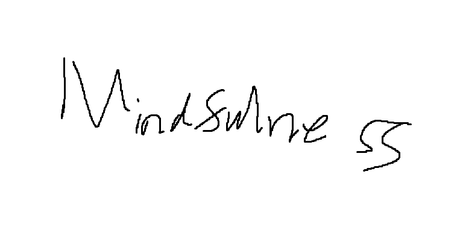

**There's a TL;DR: at the bottom. Everything else is optional leisure shit talk for your Sunday newspaper reading pleasureg. Skip any sections as you see fit**

# Table of Contents
1. [Preface / Disclaimer](#preface-and-disclaimer)
2. [Prelude: Adding Context](#adding-context-before-we-get-to-actual-content)
	1. [Don't Sleep on the East](#dont-sleep-on-the-east)
	2. [West vs. East](#the-difference-between-western-meditation-and-eastern-meditation)
3. [Chapter 1: Mindfulness is comparatively myopic](#mindfulness-is-comparatively-myopic)
	1. [Recontextualizing Mindfulness](#recontextualizing-mindfulness)
		1. [Conscious differences between Mindfulness and Enlightenment](#conscious-differences-between-mindfulness-and-enlightenment)
		2. [Two Axis of Consciousness](#two-axis-of-consciousness)
		3. [Mindfulness vs Mindlessness Spectrum](#mindfulness-vs-mindlessness-spectrum)
	2. [Enlightenment Spectrum vs Consciousness Science](#enlightenment-spectrum-vs-consciousness-science)
4. [Chapter 2: Enlightenment and things like it](#enlightenment-and-things-like-it)
	1. [What is Enlightenment?](#what-is-enlightenment)
	2. [Flow](#flow)
	3. [Psychedelics](#psychedelics)
	4. [Ego Death](#ego-death)
	5. [Duality Transcendence](#duality-transcendence)
5. [Chapter 3: Science Builds Epiphanies](#science-builds-epiphanies)
	1. [Science Misportrayed by Media AGAIN](#science-misportrayed-by-media-again)
	2. [Hypnosis and Sound Harmonics](#hypnosis-and-sound-harmonics)
	3. [Learning Nothing in Neuroscience](#learning-nothing-in-neuroscience)
	4. [Back to Harmonics](#back-to-harmonics)
	5. [Spiritual Harmonic Philosophy](#spiritual-harmonic-philosophy)
	6. [Spiritual Karma](#spiritual-karma)
	7. [The science version of Karma](#the-science-version-of-karma)
	8. [CO2 benefits of meditation](#co2-benefits-of-meditation)
	9. [Lessons from Creativity Neuroscience](#lessons-from-creativity-neuroscience)
	10. [Brain Wave Studies: Deliberate vs Effortless mindfulness](#brain-wave-studies)
	11. [Evolutionary Sleep Sophistry](#evolutionary-sleep-sophistry)
	12. [Timing Personal Development and Relaxation](#timing-personal-development-and-relaxation)
	13. [Oversimplifying how Soul looks in Brain](#oversimplifying-how-soul-looks-in-brain)
	14. [Relearning Trauma](#relearning-trauma)
	15. [Narratives see](#narratives-see)
	16. [Time to Grieve](#time-to-grieve)
	17. [Suppressing vs Processing Emotions and Thoughts part 2](#suppressing-vs-processing-emotions-and-thoughts-part-2)
	18. [A note on Emotional Empathy](#a-note-on-emotional-empathy)
	19. [These things we call Emotions](#these-things-we-call-emotions)
	20. [Pleasure-Pain Balance](#pleasure-pain-balance)
	21. [Reward Prediction Error](#reward-prediction-error)
	22. [Breaking Habits](#breaking-habits)
	23. [Play](#play)
6. [Chapter 4: Back to Enlightenment](#back-to-enlightenment)
	1. [Why Enlighten](#why-enlighten)
	2. [Should You Meditate](#should-you-meditate)
	3. [Meditation vs Enlightenment](#meditation-vs-enlightenment)
	4. [Self-Transcendeence](#self-transcendence)
	5. [Aritifical Intelligence](#artificial-intelligence)
	6. [A Summary](#a-summary)
6. [Too Long I Did Not Read](#too-long-i-did-not-read)
100. Pic example in case I want to add pics later

# Preface and Disclaimer
[Return to ToC](#table-of-contents)

If you do decide to engage in these 80 pages though, I'm putting 4 years worth of Ivy League Undergraduate Psychology (~$250,000) for free here, minus the bullshit. Grab some hot cocoa, because it's gonna be a long one. Also, if you know someone interested in Psych, but not actually interested in advancing Psych Research, probably just have them read this instead of getting a Psych degree.  Chances are, your buddy doesn't actually want to know psychology, they just want to know more about their mental issues and how to address them. *You'll find everything (outside of niche conditions) in Psychology that is 1) worth mentioning +  2) that is universally applicable to everyone, alluded to here.*

Shout out to Dr. K, Andrew Huberman, and Scott Barry Kaufman, these are the giant shoulders I lean on. Much of the information here is word for word from them. No need to reinvent the wheel here.

What to expect from this: A deep-dive into what Enlightenment is and how Enlightenment is reached. What you won't find here is practical advice, I don't give you actual meditative practices to try out. But I do tell you what the path to Enlightenment looks like. If you have a basic understanding of what this path looks like then you can carve your own way to Self-Actualization, and even beyond that, Self-Transcendence. "I didn't change your life. You changed your life. You actually changed. You took the action. You changed your thought process. You changed your mindset. You change your mind. We may have assisted in help and gave you some clarity but none of my books tell you what to do. Your whole life people been teling you what to do. Psychology is about doing what *you* do...What lights your fire. What gives you clarity up in here. And nobody can give you that. They can explain it: how other individuals do it. But you still have to add." ~Tim Grover

Disclaimer: Don't trust me. I could be wrong. Don't take anything here for granted. In fact, most things in here are likely wrong because I'm trying to provide guidance but can only do so through words rather than felt experiences. But things do not need to be right for you to try them and see if it works for you. Do your own research and come to your own conclusions. All of the knowledge I have gained is not correlated with reality. The knowledge is just correlated with my own real experiences. But remember this lesson from dreams, just because you really experienced it, it doesn't mean it aligns with reality. Science may never advance to a point where we know what is right. But we don't need science or facts here. Enlightenment is all about a way of describing a particular type of subjective experience. Something does not need to be right for it to be a subjective truth; Feelings don't care about facts. In this dimension, the only things you can truly know is to do it yourself, to experience. You won't know if you like bananas until you yourself have eaten bananas. So, do mesearch, you see for yourself if the knowledge here matches with your real experiences. ~ADIO

# Adding Context before we get to actual content
## Don't Sleep on the East
[Return to ToC](#table-of-contents)

The mind and body are one, and as one, they create the felt phenomenon called Soul. (Descartes thought that the soul was an immaterial part from the material parts of you, and in a sense he's right because there isn't a single spatial-material place to identify and be like, a-ha! that organ is responsible for my consciousness. But we now know that your felt consciousness is an amalgation created from the whole mind-body's bioelectrochemical systems.) Your relationship with your soul has the largest effect on how your nervous system operates, fourth only to breathing (which is not only a requirement to life but also every single breath has reverberating effects on the whole mind and body, the whole nervous system), and sunlight viewing behavior (because syncing of the harmonic rhythm of all your organs to your circadian clock reduces the otherwise resultant traffic jam cacophony, and when tuned well will automatically level your up your intimacy with your soul,) and diet (Every cell runs on glucose whether you like it or not.) Anything else than those 3 pales in comparison to soul. And if you think you can list something more impactful, it's only cause you're some sort of health optimization freak, you probably join homeopathic gcults that have doctored you to think that if you follow their advice you could do things like reverse myopia. Your relationship to your soul was evolved for survival, not evolved to be happy, so the nature of your relationship to your soul will affect your internal response to all things external. Look, you science worshippers and ayurveda doubters (ya'll know who), their insight into the 3 doshic categories (kapha, vata, pitta) is a heuristic pointing to a fact of human life. If you're some shade of down depressed, that's the equivalent of communicating to your body to stop stop stop, conserve energy, chances of cultivating resources in your environment is low, so find a place where you can keep a low profile and rest alone as you hope the danger passes you by. If you're some shade of energetic and anxious, that's the equivalent of communicating to your body to stay ready to go go go and run to forage and find food. If you're some shade of straightforwardness and anger, that's the equivalent of communicating to your body that if we engage in competition now, we are going to get the good stuff we need to survive. Which of these 3 modes you tend towards (freeze, flight, or fight) will in turn bias the type of neurochemical information being sent from brain to body that informs how your body should respond to nutrients, and how your body should prepare itself physically to enhance ones reproductive fitness. Sure, you can override these effects with excessive dieting (because what your body can do is limited by what's available to use), or with forced physical activity (because your body will force itself to make metabolic arrangements for what you actually end up doing). But outside of weirdos that do that kind of stuff, Soul is #4 on the list of huge body impact. And Meditation is about increasing your chances of unlocking a 4th mode in response to conflict, the calm and connect mode. Spiritual growth influences everything, from how you move to how you breathe to whether you even decide to spend time engaging in the deliberation of picking up a diet change or exercise regime or healthy sleep or how you socially interact. Anyways, this will be a deep dive into the one scientifically verified treatment, that is not placebo, that actually affects all mental illnesses, and has verifiable mild to moderate benefits for all people.

## The difference between Western meditation and Eastern meditation
[Return to ToC](#table-of-contents)

The goal of meditation is moksha (enlightenment). It's kind of weird but in western society no-one talks about enlightenment. Buddha didn't teach meditation so that you can have an empty mind. He was teaching meditation so you can be liberated. Somewhere along the way in the 60s there were scientists who learned meditation. The era of Transcendental meditation, the birth of the yogic hippy and groovy drugs. This lead to an interest in meditation, and then people got interested in the science, the studying of it. This is where we get the birth of mindfulness, people talk about mindfulness a lot but not meditation. Researchers tried to find the common element, which is difficult because there's a diverse range of practices, and lot of weird cultish stuff associated with meditation. They tried to remove the latter part, standardize it and protocolize it, and in doing so actually removed the spiritual part out of meditation. So they gave you the fast food version of meditation. Mindfulness is the McNugget of meditation. A uniformed thing that is not equally appropriate for everyone. In addition, the protocolization made the goal of meditation mindfulness but the goal of mindfulness is actually mindlessness. So essentially is like taking bread, pasta, naan, and rice, finding a way to categorize it: carbohydrates. Studying carbohydrates, and then feeding you a tube of carbohydrates through mindfulness or apps (by the way, Fuck protein bars).

The west has issues becauses we have a proprogation of meditation resources without meditation teachers. Now, not to say eastern society necessarily gets it right about meditation either. Many eastern mteachers are not good. Because meditation teachers tend to be only taught in one tradition. You become a certified meditation teacher by going to a particular person, you learn their particular branch of meditation. Any student that comes to this meditation teacher, they say "this is THE way to meditate". And if the teacher says this is THE way to meditate but it is not suitable for your cognitive fingerprint. Then the student walks away thinking, "I suck at meditation and meditation is not for me. Because look at this tibetan monk who's an expert on meditation. Yet, it didn't work for me." It not working does not mean you are bad at meditation, it just means that this particular meditation is not currently suitable for you.

Unlike the west where mindfulness tends to be the focus of meditation. In the east, mindfulness is like less than 1% of meditation. Supposedly, in a brief overview of history (TBH, just read the last sentence,) origins of meditation starts with tantrics, guy named Shiva. His followers became tantrics. The tantrics then discovered yoga and became the yogis. They split into 4 subclasses. One of them was Raja Yoga, the King's path, or the path of willpower (Ahdanya yoga). Buddha's teachers were Ashdanya yogis. Buddha learn Ashdanya yoga and started teaching. Buddha's teaching's divided into three branches. Vrajayana Buddhism is like tantric buddhism. Theravada Buddhism are as close to Buddha's teaching as possible. Mahayana Buddhism: there are a lot of enlightened teachers, so get wisdom from people other than Buddha as well. Within Mahayana tradition we have Zen, within Zen we have mindfulness. The main takeaway: Mindfulness is a subset of a subset of a subset in the world of meditation.

# Mindfulness is comparatively myopic
## Recontextualizing Mindfulness
[Return to ToC](#table-of-contents)

In the East there is a particular philosophy that comes with mindfulness. They view mindfulnesss more as a "Witnessing Attitude', In Sanskrit, Sakshi Bhav. There are practices seeped in Cultivating your witnessing attitude. If I can observe this, this is not what I am. Theoretically, I could lose my hand and I'd still be me. Similar process with mind: I can look at my mind, and see the mind fluctuate. I can't really be anger and I can't really be sad. I can "be" angry or sad, but since those are transient states, they are not what I actually am  I am the thing that experiences anger or sadness or thoughts. Likewise, I am not an action-taker, I take action. So what is I? The further back you go with this logic the more you get to the witnessing attitude. This is what you practice doing during mindfulness meditation. Essentially, in mindfulness meditation, you spend time doing an attitude of witnessing, and as a ersult will gain familiarity with the nontrasient parts of who you are. To really form a solid connection with the part of you that was with you since birth, and will stay with you till death, the thing that makes you, you. Since it is a connection to the nontransient, it is therefore a source of stability that serves as the foundation of all actions you take.
 
## Conscious differences between Mindfulness and Enlightenment
[Return to ToC](#table-of-contents)

A brief reminder, that although the west talks about mindfulness as synomynous to meditation. In the east, mindfulness plays a part but is by no means the center of attention for meditation. Moksha, enlightenment, is the goal, and mindfulness is just an approximate bootleg version of enlightenment. The difference between mindfulness and enlightenment is rather simple, but very hard to describe in words. In the same way that sight is hard to explain to the unsighted, but there's nothing particularly difficult to understand about sight once you've experienced sight. Likewise, once you know enlightenment, you know. Gaining knowledge is the hard part. The Hindus have created a 2 axis heuristic for dissecting and thinking about consciousness, that hopefully help the uninitiated gain some insight into enlightenment. 

### Two Axis of Consciousness
[Return to ToC](#table-of-contents)

In this 2 axis spectrum of states model, we think about Mindfulness as a state of consciousness that lies in one of the model's quadrants. On one axis, we have high mind/thought activity to none, no mind activity. On the other axis, high awareness to no awarenss. Now, where does the mindfulness state of consciousness lie in the 2 axis spectrum of states model? Well, lets think about some of the other quadrants first. (These examplse aren't perfect but bear with me but,) when there's No mind activity, No awareness = Deep sleep. On the other hand,, when there's High mind activity, High awareness = your average waking day (or a really lucid dream). In between, there is High mind activity with ittle-to-No awareness = dreaming/daydreaming. As for Mindfulness? It is in the last quadrant, High awareness and really close to No mind activity. 

Then, where does mindfulness place in terms of Englghtenment? Note that there are several paths one can take to enlightenment, Mindfulness just happens to be one of the paths that can serve as an introduction to the spectrum of high conscious no mind state. And in this introduction, you merely learn to dip your toes and get a feel for how the enlightenment pool feels like, but still is a fundamentally different experience from immersing your whole body into the pool. 

### Mindfulness vs Mindlessness Spectrum
[Return to ToC](#table-of-contents)

The enlightenment state is an extremly conscious mind, the highest awareness, and by having no mind activity, this allows for the highest possible levels of experiencing life. In Hinduism, Sakshi Bhav (witnessing attitude) aka mindfulness, is a lower level state, and is a state when the observer exists with mental activity, and/or the state of watching things, aka the state that many scientists mistakenly believe is a "no-mind" state. Traditionally, practicing the mindfulness state was not because people wanted to be mindful, it was because this is one of the ways to prepare yourself to be mindless, to enter the mindlessness state, the first actual state of Enlightenment, Dhyana - the state of consciousness that is truly a no mind state, a mindless state. The mindless state is different from the mindfulness state that scientists mistaken for "no-mind", because in the mindfulness's "no-mind" state your mind is still being allocated towards watching/witnessing rather than being. Imagine if a dog did mindfulness before it decided to feel how it felt, that's essentially what you're doing in a mindfulness practice. It has value, because not everyone is ready to embrace their most conscious sense of self. In terms of enlightenment, practicing Sakshi Bhav can help you reduce some of the noise, but ultimately, it is adding a node instead of taking the most direct and clearest path to the enlightenment state.
 
Unlike mindfulness, in the actual no mind state of Dhyana, you're actually mindless, a pure awareness, the observer actually melds with the object of observation. This is the first of many stages because Enlightenment is a continuous spectrum of different mindlessness levels. The further steps of enlightenment, a whole list of jargon you don't need to know that refer to these deeper states of consciousness like Nirbija Samadhi, Bija Samadhi, Samadhi, Moksha (The terms people use to describe enlightenment varies wildly but it doesn't matter too much. 

[If you really want to know, the various points on the axis are:
1. A *waking up* from the ego = not be distracted from things not you.
2. A *waking to* the awake awareness = meeting and recognizing yourself.
3. *Waking as* the awareness and aliveness = gaining familiarity with self.
4. *Waking in* the awareness and aliveness = comfortable familiarity with self.
5. *Waking out* to create and relate = ready to strengthen the connection between ourselves and our universe. Comes with "spacious awareness" a little more boundless feeling, a little more open mind, open heart, awe, and literally more panoramic vision.])

The main idea behind this spectrum of terms is that your spiritual growth can continuously be improved. At the upper echelons of enlightenment, there isn't really an end because it's something you continuously hone. At the top, you reach Samadhi = temporarily feel enlightened. Beyond that, Hypothetically, beyond temporary enlightement is of course, being permanently enlightenment = Moksha. In this state of Moksha, is when that observer becomes your most constant and grounded self. In this state, What happens is that your life becomes a movie. Not in a depersonalized type way though. In a very personalized type way. It's a lot to take in, so if you didn't understand the your-life-as-a-movie analogy, don't worry, it's all a part of the process, we're not here to train your mind's ability to do mental gymnastics, we're here to cultivate your capacity for awareness. Later on we'll dive deeper into this idea of the observer melding with the object of observation, and this idea of your life becoming a personalized movie. But if you already do understand the your-life-as-a-movie analogy you might as well just stop reading here, because every section is just a rehash of that analogy with varying perspectives as to why that is the case.

## Enlightenment Spectrum vs Consciousness Science
[Return to ToC](#table-of-contents)

From a science perspective, there's a very basic way of thinking about consciousness. At its core it is sentience, the susceptibility to sensation. The more conscious you are, the more sentient you are, and therefore more susceptible to sensation. (And these sensations are often resultant of underlying processes we are unconscious of.) There are many ways to catagorize different sensations/experiences, here's one way: sensation, perception, feeling/emotion, thought/metathought, behavior/action. We can think of these 5 different sensations as the 5 ways we interact with life. First, the things that you will feel nonnegotiably: intereoception (internal), extereoception (external), proprioception (space/self-location). Second, where you focus your attention will directly direct your experience (via your mental attentional spotlight but also something as simple as which way you are facing.) Third, Your energy levels, your level of autonomic arousal, in combination with the context we are in and the demands we are facing, will flavor your experience. Fourth, The way you conceptually organize what is happening within and external to us will affect the way you feel about your experience. The way you interpret the way you conceptually organize will too affect the way we digest our experience, since we have the ability, to witness from a distance, to meta-perceive our thoughts, feelings and sensations. Finally, the reflexive or deliberate behaviors we engage in actively influence the environment of what future sensations arise by changing what is happening behind the scenes in various types of non-conscious processes because note that in reality there is no mind-body dichotomy; All mental (non)activity are physical and have physical impact, and All physical (non)activity are mental and have mental impact. 

How does this relate to enlightenment? Well generally those who are less susceptible to sensation, and therefore less conscious about their experience, tend to push down the experience--for it to come back later with a vengeance. Kind of like sleeping in a bad position and when you regain consciousness, when you wake up, suddenly feeling sore. Not to say that this is a bad thing, sometimes you need to put things away because they're too much to handle for you right now. However, do note that these things weigh you down over time. Those that are more susceptible to experiencing sensation (sensation, perception, feeling, thought or behavior), are better at digesting experience, and therefore rather than letting more and more pressure live with them rent-free like champange bottles, they instead let things pass through them without a fight, peacefully. Not being conscious creates a fight within, a disconnect. Just like in the bad sleeping position example where you weren't mentally aware of your bad sleeping position, but your body felt it. (Note: not to say that just because you aren't currently aware of an experience that you didn't have conscious experiences, think Multiple Personality Disorder where there's multiple streams of consciousness, or dreams wehre you have an unconscious conscious experience, or anesthesia amnesia, or split-brain patients, etc... there are situations, where systems and parts of the body that entail conscious experience but don't enter the conscious stream communicated to you. But for our purposes we only care about the conscious experiences that are communicated to you.) Your mind will to try to convince you you're fine because now you're well rested. Your body will convince you that you're not fine and to treat your body better. So, who's right, your mind or your body? The trick here, there is no conflict here. You're not fine and you're not not fine. You're just well rested and sore. You just acknowledge both sides of the argument (don't add more layers to the argument!), and you feel how they make you feel, and then move on.

To be more conscious, to be more sentient, is to experience experiences as they come. To have felt experiences simplifies things and makes you run more efficiently. Consciousness is a fundamental feature of the universe. We're not beings with higher consciousness than other animals. Sure, we can have conscious experiences that they can't but we're equally conscious. The only difference between us and other conscious beings is that we have the capability to complicate things (and therefore do cool things like create technology). And we often make very simple, ordinary things more complicated than they actually are, the worst part is that we don't even recognize it! For example, many people think they feel fine. Fine isn't an actual feeling, it's just a way of describing how things are going for you. You can feel content, adjusted to your situation, relieved, but you can't feel fine. You can only feel what you feel. Feeling fine is an umbrella term, it paints a broad picture, and opens you up to not exploring its contents. Everytime you tell yourself you're feeling fine, you're ignoring what you actually feel on a fundamental level. There may be a strong signal to your most constant sense of self, but the connection is still weak because of all the noise, and therefore your life becomes less as a personalized movie. That is, you're experiencing less.

# Enlightenment and things like it
## What is Enlightenment?
[Return to ToC](#table-of-contents)

It isn't a state where you are permanently happy. Enlightenment is not an emotion. Enlightenment is a state of peace or contentment but not an emotion. It is peace in despite of sadness or happiness. People who are enlightened gain detachment from their emotions, you still experience emotions, they just don't bother you as much. And this axis runs perpendicular to the emotion axis. On the other end of this axis is suffering. So, there are people that suffer despite feeling enjoyment or sadness. That is, You can have a lot of positive emotion, a lot of enjoyment, you're not feeling sad, but there's a cosmic sense of suffering, like your life feels empty. 

This axis of enlightenment and suffering is independent of the axis emotion, because emotions are fluctuations of the mind. For example, you don't (at least hopefully) feel sad forever. You feel sad when something bad happens and your mind equilibrates over time. And similarly, you don't feel excited forever. The weird thing is when you are enlightened, even sadness is enjoyable. There is contentment despite feeling sad. Think about this. Do you enjoy listening to sad music? Do you enjoy watching sad movies? When you listen to sad music, how do you feel? Do you feel joyous? You feel sad/hurt but you enjoy it. How does that work? What is the difference between feeling sad and being able to enjoy it as you listen to sad music/watch sad movie, but you feel sad and you don't enjoy it in your real life? The difference is the detachment in the former. It is not your life. This illustrates the idea of enlightenment. When you become enlightened, it's like your life becomes a movie. Where you can start to appreciate all the negative things. During the movie you recognize; Does that suck? absolutely. Do I feel for you? absolutely. You experience a seductive connection to the felt feelings but yet there's this overwhelming contentment or peace. Because what's the difference between your life and a movie? It's that separation between you being in it, and you enjoying the feeling of it and yet detached to it. You are detached but not in a depersonalized way though because when enlightened you are still engaging the movie as an actor, as opposed to being disengaged as an audience member.

You may have personally experienced this detachment in other places as well, like a breakup. It feels bad when you go through it. Later on you start saying weird things, "Oh, man, I'm so glad that relationship ended. It hurt, but I feel so much better now. I still miss them but it was the right thing." This process of detachment, Vairagya, of going from the former (less enlightened) to the latter (more enlightened) is the goal of meditation. Most people naturally spend a lot of time processing so people tend to be more enlightened than their younger selves. People wonder how it's done, but it is merely the difference between when you are in the middle of it, and when you process and detach but not depersonalize.

Something akin to this movie metaphor is what they mean when they call enlightenment moksha's liberation. They mean that knowledge simultaneously comes with freedom and bliss. For this process to happen you generally will need to approach it in a multifactorial way, since there is many ways this process can happen, and since you generally benefit from this process happening in different ways. Therefore,there is no one size fit all, and is a choose-your-own path. Nonetheless, throughout this text I try to detail various psychological understandings but only including those that woulld apply to anyone and everyone.

So, How do you self-transcend into this life-as-a-movie state? Anytime you find something that helps you dissolve a part of your ego, you self-transcend a little. More specifically, the process of ego dissolution is also the process of self-actualization, because dissolving your ego puts you in touch with your truest and best version of yourself. Moreover, the process of self-actualization is also the process of self-transcedence, because dissolving your ego effectively and therefore getting a clearer sense of self also results in clearing the debris that was blocking the connection between the observer and the observation. Before I dive into the nitty gritty of how-you-become-enlightened-via-ego-dissolution though, I will tell first you what it won't look like, go into some psychology history, as well as share insight into how the underlying mechanisms of your mind function.

## Flow
[Return to ToC](#table-of-contents)

Flow has many similarities and therefore overlap with the enlightenment spectrum. In the flow state there is not a whole lot of mind, a little mind there that is one-pointed/kind of absorbed in the mental activity, that is fully focused/engaged on what we already know how to do, and is a high conscious state. A state where the self and the mind kind of become one, because our sense of interoception and extereoception suits our goals perfectly and it just feels right. Flow is a state where the sense of self melds with the activity of observation, thanks to our brain-body's ability to figure out what needs to be handled here and peeling away all the irrelevant stuff from our attention.

What makes flow state different from Enlightenment is that being fully focused is not a requirement for Enlightenment because Enlightenment is where the observer-self melds with observation regardless of whether our mind is in sync with desired-task or whether it is doing whatever off-task activity the mind pleases. Essentially, Enlightenment applies to more situations than flow does.

What flow state is specifically, is an expression of what we already know how to do. Flow is not a state for making errors/learning (well sort of, because you can have a bout of learning where you are making errors and learning but it doesn't come with a strong enough sense of error to deter you from your state of full focus.) That sense of error, that sense of agitation, is the highlight mark that is an expression of what don't know how to do yet. That sense of agitation, is really a sense of pain, and what pain does for us is highlights areas of your brain for change. This highlighting is important for neural plasticity, which is the changing of connections in the brain aka learning. So, flow state is the state of being highly engaged, as opposed to the state of agitation that engages the highlighting of brain connections for change aka learning. Thus, flow is a state which often lends itself to a sense of just being, and thus a sense of detachment. The difference, you can be in a state of enlightenment (which if you remember, is essentially maximum detachment but, not in a depersonalized way, in a very personalized-self-expansive-melding way that you can be in,) even if you are in a state of agitation/learning. But you basically aren't in a state of flow if you are activating the learning centers of your brain via agitation, because flow is the expression of connections in the brain that you are very familiar expressing. To be clear, there's often an in and out with flow, so flow is suitable for learning, it's just not for learning. This state of focus and narrow context setting (i.e., the peeling of irrelevant information) allows people to experience deeper satisfaction, learning, growth, and neuroplasticity. Both enlightenment and flow are about being absorbed in an existence, but flow is specifically about skilled and/or familiar activities.

(Sidentoe: There's two forms of flow. Absorbed which is more focused/concentrated and after the task you realize much more time passed than how much time you feel like passed even though you feel like your sense of time was intact. Panoramic which is more like being in the now, very present focused but in a you-lose-sense-of-time type of way, can be absorbed too but more aware of everything around, which feels like you are aware from an open interconnected space.)

## Psychedelics
[Return to ToC](#table-of-contents)

Why did drugs and meditation and hippies come together? Because psychedelics can come with ego dissolution which can move you towards enlightenment. People that take psychedelics often talk about separating from their life. For example, psychedelic therapy can be useful for people with PTSD. What happens is that a traumatic event and/or traumatic experience that shapes your personality and the way your neurons are wired. Essentially, you get trapped within your own mind. You get so stuck in that traumatic experience. For example, if you have a fear of abandonment. You are so concerned about being abandoned, "I'm going to be abandoned. I'm going to be abandoned." Someone with those type of thoughts, just from their language you can get a hint of them reliving the past, that that they're in it: "I am." What the psychedelics might do is remove them from being in it, removing I'm. And combining it with therapy, the goal is to have them step outside of their fear of being abandonment, "I have a fear of abandonment." Going from I am to I have, and suddenly the fear of abandonment is outside of you. It's not you, in the same way your hand is not you. It's not "I am in pain" it's "my arthritis is acting up." Training the mind to notice that their mind runs programs like the abandoment.exe program, or the in_pain.exe program. Programs that at some point served as defense mechanisms but now are disserving you as malware. And fostering understanding that your mind can do whatever it wants down there, and that you are up here, that there's distance. That when your mind activates certain modes/programs, it manifests in a bunch of weird ways because you don't understand it. Understanding what happens when you feel x y or z, and how it impacts all of your interactions. Once you become aware of its existence, that allows you to every now and then use your 'detection' skill, to see if .exe program is acting up again. Improving your detection level is important. The problem is all these things such as the fear of abandonment, they're like invisible, all cloaked, you can't detect them, you're just living your life and there's some invisible psychological thing beating the crap out of you. You can sort of come up with makeshift ways of handling it, but until you really make visible what's invisible it'll just continue doing its thing. Once its visible, you can start cultivating detachment from it.

That's just all conjecture though. For sure, ego dissolution is something sometimes people experience from psychedelics. We just don't know how it works and it could be that different psychedelics work through different means. I've seen some things about parallel processing, others about messing with the communication system between the brain nerves and body nerves. Whatever the case though, don't treat psychedelics as people have had lasting negative effects from them as well.

Whatever psychedelics do do though, all psychedelics do is activate your existing brain. Substances don't change what your brain can do, it just turns it on in a particular way (that may lead to very traumatizing psychedelic trips and/or psychosis that is life-threatening to you or your surroundings). So, theoretically anything that can be done with a psychedelic can be done without it (theoretically, reality may not be true.) Like if you look at marijuana we have endogenous cannabinoids. If you feel euphoric and chill when using marijuana, you can also experience that without marijuana. The brain has to be able to have that experience in order for you to have it. Although the one thing the brain can't do without marijuana is give you moobies (because it contains unidentified chemicals that promote aromatase activity which converts testosterone to estrogen.) Stay away from drugs friends because they cause some really crazy shit you wouldn't expect till it's too late.

## Ego Death
[Return to ToC](#table-of-contents)

The epitomy of spiritual experiences: the Out-of-body and the Near-Death experiences. When people experience one or both of these things, they are often life-changing and even personality-changing. How do they work? Yep, you guessed it; Ego Dissolution. In a sense, even without having a near-death experience, dissolving your ego is like killing a part of your self off because everything that can be described as identity is also ego.

Humans are social beings. Most of our evolutionary advancement is due to our ability to form identities, which in turn also had the side effect of us being able to entangle with the world in much more complex ways. The Default Mode Network (DMN) is our part of the brain that is (sort of) responsible for our ability to have a Social Identity, an extremly abstract and complex skill. The DMN allows us to be self-aware, to reflect upon ourselves, and think about things in terms of ourselves. Not to say that that is DMN's function, the DMN's main role is to provide communications between different parts of the brain and therefore fostering very interesting connections, that is, to associate things with other things. Our improved ability to form brain-area connections is why we can engage in abstract things like Social Identity and fulfill our role in our society to advance Human's reproductive success, and why we can engage in things like increasingly advancing technology. 

Now, to be clear, there isn't a part of the brain that is Ego. Ego is just a way to refer to the things that build us up in an inflationary way, a way that drives us so strongly that it feels like we feel more powerful but despite how good it makes us feel our confidence does not go up with it. Ego at its highest levels is Narcissism, when people appear to be full of themself but deep inside they are not confident in who they are and they function in a way that is so out of tune with their internal sense of confidence that they may not even realize their own lack of self-confidence. To be clear, being full of yourself, being narcissitic, does not have to look like fake-confidence, nor arrogance, it just has to be making it about you (especially if it's something that isn't necessarily about you.) “I’m saying your extreme rejection of and hatred for yourself is narcissism. Normal people aren’t that interested in themselves.” ~Dobu from Odd Taxi.

Ego is the opposite of astute confidence. It is the opposite of our ability to be confident in the face of uncertainty and in the face of possible failure, or to be able to put our best foot forward and recognize that is all we can do. Ego is putting everything on the line as if it is do or die, to act as if our desired outcome will happen no matter what or we die trying. Specifically, Ego refers to all the human phenomenon that has a very adaptive function and served our evolution well, but may be hindering us in ways that hurt us on a spiritual level. Ego has survival utility, and success utility, but not so much happiness utility. That is, you weren't designed to function without your ego but if our needs are met, then we don't need to hold onto the ego, these archaic mechanisms; And it just feels so nourishing when we don't hold onto them, when we let them go. But it takes work to get to that point. It wasn't designed to be easy. It is hard for people to let go because they don't wnat to let go. When you try let go, all of the crap that your mind produces is the reasons why you cannot yet let go. Mental crap you may want to consider throwing away (which won't be an easy thing to do because as you engage in the process of ego death, this process where our sense of self dies, your mind is going to fight on for dear life, "how dare you set me aside? What about me? I been there for you this entire time. What about all these things I'm [insert emotion] about? You're just going to let it go? Fucker, I don't think so I'mma hang onto that." A terrifying experience as you grapple with these currently core parts of yourself, as you let go of all the things that you love and respect about yourself. You feel terrified because your ego thinks it's going to die, that it'll go extinct. The ego, for our sake, does its bet to perserve itself which is why it is very normal for the mind to reject meditative practices. But it won't die, it'll be there, it evolved to be there, which is why enlightenment is continually honed.) Until we become able to let go, we will continue to hold onto these adaptive mechanisms, that served to protect ourselves, but in our current context has become maladaptive in ways that makes you feel suffering rather than contentment. The reason why it came to be this way, the reason why it takes work to let go of these learned (mal)adaptive functions is that because we're good at learning and coordinating the various systems of our body. The DMN finds ways to share a ton of possibly related information to various parts of the brain. And in the event that the other brain parts identifies that the shared information is of interest, that is, information that served us well in some way at some point, we solidify those connections as an informative base. A base we use as a default way of navigating through our eventful life. And the more our learned mode of operation is reinforced, the more likely we're to confabulate a strong sense of identity with it, such as. "I'm a studious doctor." Identifying with ideas rather than recognizing the reality of it. Rather than being a studious doctor it is more accurate that you are someone who has learned and reinforced studying behavior, and has accumulated a lot of medical knowledge. The faulty of identifying with identifications instead of reality is that there is no telling if one day you just randomly lose your doctoral license, will you still be a doctor then? Or there's a zombie apocalypse that doesn't give you time to rest. Will you still be studious then?

A large part of Ego is our sense of identity, and during such experiences of Ego Death, out-of-body or near-death or other, it completely smashes all things Ego, including the identity. This is why people's personality change after such experiences (not always for the better, looking at you Hitler & Thanos.) When you are on the verge of dying, your body is put at the very highest levels of enlightenment because there is no need to rely on all the things DMN serves us such as Social Identity or connection formation. This is our last few moments of life, and when the DMN's volume levels are at levels of serenity, near-zero levels, there's no wonder why we may relive our life in those few moments because when all those connections that were distracting us before are no longer activated, then the deepest and most subconscious parts of ourself can come out. 

In a very similar sense, those who are extremly devoted, not necessarily in a religious way were studied. Researchers found that the devotees well-practiced in prayer and faith, that if they were to pray, they not only turn off their DMN (well more accurately, make the DMN focused solely on the felt experience) but they are able to turn off their sense of physical self. Their proprioception, (in particular, the brain regions associated with) their sense of location actually gets very inhibited. Which in turn creates a very unique sensation, an out-of-body experience. Some people report their experience is akin to seeing themself from a bird's-eye view. In addition, while praying and being faithful, you're making a conscious effort to focus on one thing and one thing only, which drowns out all other thought-bubbles or emotions that may arise (providing some insight as to why some people self-harm, where you just focus on one particular sensation during self-harm. There are other reasons people may self-harm, namely control.) This should put into perspective why devotion, especially religious ones, has had such a strangle hold on the world. When you are devoted in one-direction, it suppresses all of the evolutionary-adapative mechanisms that causes us suffering, and it actually gives us a sense of spiritual contentment, an empowerment, towards whatever it is that we are devoted to.

Devotion and Ego-Death are highly tied together, such that, both phenomenon completely simplifies the way our brain functions neural-electrochemically by favoring a neural environment accustomed to producing tremendously less mental noise diversity, and thereby making the leftover neural signals front and center of our attention. (Well not always, sometimes when ego-death like situtions occur, the sense of self can get "destroyed" through expansion because there's a high entropy state of the mind. So, like massive amounts of connectivity is happening, such that the sense of self gets disorganized and diffuse. Which can be a traumatic experience, as this disorganization can leave your sense of self feeling shattered, the sense of self that was once comparatively low entropic and very simple, is now leaving you feeling uncertain, can't make sense of things, and out of it as if you entered an abyss. On the other hand, this diffusion kind of helps with feeling a sense of connectedness to things that are not you, and therefore be a spiritually uplifting experience. Psychedelics tend to cause ego-dissolution through ego-death and/or ego-diffusion. This process of all this connectivity happening can cause PTSD, and often requires some form of self-development and processing after. So, stay away from drugs, or at the very least don't do them in unsafe environments or around people you don't trust your life with. You want to be prepared to digest whatever RNG gives you.)

## Duality Transcendence
[Return to ToC](#table-of-contents)

One focus of meditation is to sit with duality. To acknowledge that things can Coexist. That just because there's two very opposite extremes of describing something, that does not mean that one of them has to be true and the other not true. They are both true and they are both false. One of the things gurus teach you about is the folly of language: that is, the difference between things with quality and things without quality. Quality refers to that which can be described: descriptions, the ego, identities (such as Doctor/Weeaboo), scientific facts. Therefore things without quality are the things that cannot be described, most notably, enlightenment or extremely abstract concepts like dimensions beyond the 3rd. More specifically, descriptions are useful ways to help others understand what thing you are referring to, but at the same time, descriptions are far from accurately describing the thing you are referring. That things are not opposites. Things are not good or bad. Holy and Evil are just reasoning mechanisms separate from the thing itself. A form of pro vs con, where good is pro-societal and bad is anti-societal. Things are neither bitter or sweet. Think about this, How to describe the taste of a strawberry? A strawberry isn't sweet bitter or sour. It is what it is. A strawberry doesn't taste sweet bitter or sour, it taste like a strawberry. Those descriptors are just ways to approximate the taste of a strawberry, but you could never put into words how a strawberry tastes. You could never put into words what active focus looks and feels like. Descriptors are concepts of the mind that are not true to what things actually are. You may save lives by doctoring, but you're not a doctor, you're just you. Not to say descriptors are useless. When describing something, the people who know will know what you mean. But don't get it twisted, just because people understand what you mean, that does not mean that your descriptions actually accurately depicts the thing you are trying to describe. Descriptions have a strong potential of distracting you from seeing things for their true identity; Things are simply what things are. Anytihng more is either just the mental constructions laid on on top of reality and/or a felt sensation of sensory input that you truly feel but nonetheless are distinct from reality. Our ability to label, to create abstract categories of the world, to indulge into these constructions of duality, was a result of a self-servicing push to survive and procreate. Without this we would not be where we are. Unfortunately, for many people, when they engage in these abstractions in a way where they forget to acknowledge the distinction between what is an interally confabulated feeling/thought produced by our nerves and what is reality, this is what leads to suffering. That is, when we solely have biased self-processing, which is the way we process information as it relates to the ourself, is what leads to suffering. And if we transcend the way we think about our sensory experiences, such that we realize that it is false to believe our mind was evolved to prove accurate representations of reality. Instead, our mind was evolved to process information in a way that serves the self. Realizing this is how we transcend duality and therefore go beyond the meaning-making mechanisms that were designed to cause suffering for the sole self-serving purpose of surviving and procreating. Suffering that is a result of the mechanisms creating a distorted and self-serving biased sense of one's relation to others, of events, of the external world, and of the self. This explains why even if your life is objectively better (or wose), a reason why you suffer may be that the way you process information is worse. Likewise, as you read and process all the information I'm sharing, realize that no descriptor of enlightenment can actually describe what enlightenment is like. Descriptions of it detract from what it is truly like to be enlightened Therefore, the only way to truly know enlgihtenment is to try to taste it for yourself. 
 
One focus of meditation is to cultivate your ability to respond. Mental constructions are valid, whether they come as emotions or thoughts or some other form. The tricky thing about mental constructions is that the stronger the constructions are, the more you think it is reality, when in actuality, the less likely it is to be real. For example, as you become more angry, your perception of reality gets more distorted the more angry you feel, but if you talk to someone that's angry you will likely find that they think their mind is 100% accurate. This is a really tricky and problematic mental phenomenon where the more distorted our perceptions are the more convinced we are our perceptions are correct. What you need to recognize is that your mind-body will just generate all types of feelings, responding to the environment as it should. Your mind-body is a feeling-generating machine. The thoughts, emotions and other feelings are generated from all types of random stuff. Like, if you see a kangaroo in the street, you're just going to have a lot of kangaroo-related thoughts and emotions. These feelings are valid, and you're not responsible for these feelings arising because you were just going down the street and there just happened to be a kangaroo. Like not only is the circumstances out of your control, but what feelings arise are out of your control. You're not responsible for your feelings, not for what your mind generates. What you are responsible for is how you respond to your feelings, how you act in response to things your mind generates. The main mechanism for gaining power in how you respond will involve a combination of noticing, detaching from, and digesting. These three things empower you to respond to the world as you choose. To choose to cultivate feelings in a particular direction. You can't choose what feelings arise, but you can choose to build towards a direction that changes the likelihood of which feelings arise. The goal of meditation is enlightenment; The value of enlightenment is to empower your ability to respond to and impact the multiverse meaningfully and dutifully.

As mentioned, one focus of meditation is to train yourself in experiencing, to be in tune with your experience, to digest sensations, however do note this following distinction. Elemental (emotion personified) vs an Elementalist,someone who elements. There is value in being in touch with the brain and body but not necessarily unifying the brain and body. When you unify the brain and body you become an elemental, you become whatever you are feeling personified. Many negative effects on people's own lives or other's are due to people being unable to regulate their mind when they have high levels of adrenaline in their body. So they become like an anger elemental or an anxiety elemental, anger-personified/anxiety-personified. Decoupling what you feel in the body from the brain allows you to become someone who can choose to engage in a feeling or not, one who elements, rather than one who becomes an elemental. There are two chemicals in you that are designed for you to take action in the environment, adrenaline and cortisol. With them comes a sense of agitation (which depending on your perspective will dictate whether that agitation is irritation or excitation). Now, you can't completely seperate the mind and body agitation because cortisol goes everywhere. But Adrenaline, adrenaline can't cross the blood brain barrier. If the brain wants adrenaline it will release it on its own. Brain-released adrenaline is called epinephrine (a very important molecule for biasing the brain-body toward action. Without it, it is very hard to get out of complacent inactive states.) Since much of meditation is about noticing how your body feels but distancing your mind from them, a part of that is because of you actively suppressing how much epinephrine is being released in the brain, in the face of an adrenaline-releasing event. (Therefore, therecan utility in mixing both worlds. That is, either keeping the mind calm as life-stressors make your body excited and alert, or keeping your mind alert and focused as your body is calm as you are studying/learning.) Studies show, that any activity that is both easy (as in simple to do/not complex) + challenging (as in it grabs sufficient amount of your attention) provide the best opportunities to help you become the elementalist rather than the emotion-elemental. So, if trained, while enlightened you become more able to notice, acknowledge, and accept what feelings or thoughts or other sensations arise, and then to commit to the actions you choose to take, regardless of whether those actions match or doesn't match your internal experience. Later on, Dharma will be talked about as one way of helping you decide which direction to commit towards.

I previously mentioned I was going to talk about how, Ego Dissolution => Self-Actualization => Self-Transcendence, after talking about enlightenment and things like it. But it is worth it to first dive into some overly simplistic brief (and likely inaccurate) touch on psychology history as a science. As previously mentioned, in reality there is no distinction between mental and physical. So, although, enlightenment is a path of spiritual growth, the reason why there are so many paths to enlightenment, is because we were designed to make it happen, or an approximate of it happen in as many different situations as possible, with the caveat of safety and reproductive success coming first. Likewise, it is worth checking out what a field that is devoted to obeying rigorous research methodology and how they are approximating a path towards enlightenment using science.

# Science Builds Epiphanies
## Science misportrayed by Media AGAIN
### When Positive Psychology used to be Happy Psychology
[Return to ToC](#table-of-contents)

Nowadays, Positive Psychology is a field focused on peoople developing holistically, but there was a time when all they talked about was acheiving happiness. And Look, you know it, Marty knows it, positive thinking is a scam, and it will never work.  There is SOME merit to it, but for the most part it will never work because the conditions for it to work don't exist, and it works at the level of the mind rather than the level of consciousness. And you don't learn things unless it reaches your subconscious. Many things in your mind expire and do not reach the subconscious. Not to mention, you don't need to convince yourself of anything, that just causes more problems in the mind; When you engage in positive thinking (or someone else engages you with positive thinking) you engage in A War that looks a lot like imposter syndrome. However, the focus on happiness, and positive thinking was critical to pivoting the direction of psychology, a science previously strayed by a focus on what is comparatively easy to quantify: reducing symptoms, reducing harm, reducing negativity, treating instead of building strength. We had to start somewhere to make this change, and happiness positive thinking was a no brainer as a foundational start. It is easy to quantify, understanding of the brain was still fresh, new technologies were developing, humanistic psychology was thrown to the wasteside and could finally be picked up to be rebranded without the negative connotations associated with it (rabbit holes, psychedelics, cults, WEEWOO scam-artists, "just find yourself bro" cliches, and all else spiritual/hippy) and my boy Marty just got elected to be the president of the APA (American Psychological Association.) Marty (founder of Positive Psychology) knew this was just the beginning, and quickly reframed the happiness model to one of PERMA (Positive Emotion, Engagement, Relationships, Meaning and Accomplishment, each of which touched upon in one tangential way or another in this writing,) which provided a foundation for people to study all the cool catch phrases we use today like Grit and Creativity, and all the other stuff we actually care about. Not to say positive thinking doesn't have utility. 

## Hypnosis and Sound Harmonics
[Return to ToC](#table-of-contents)

The placebo effect is real. If it wasn't, many mental illnesses would be way easier to solve, because many of the thought bubbles that result from mental illness, the people that experience mental illness often don't believe the thought bubbles and are aware the thoughts don't align with reality, but it doesn't make the effects of these thoughts feel any less real. Vice versa, If you think it, it will affect you. And the effect might even be strong enough for you to start feeling and believing the thoughts, given that there are appropriate external and/or internal environments that favor its installation, that further increase your suggestibility. In this section we talk about when the conditions are met for positive thinking to work. It is ultimately about creating a holistic environment that favors installation and suggestibility via the usage of hypnosis and/or sound harmonics. Essentially, the modern day version of a warcry.

Our friends at Stanford are creating hypnosis tools (they also do other cool stuff like research acupuncture) that help people bring your state into states of deep relaxation, essentially disarming your mind and opening your consciousness. Thee hypnosis, (usually aduio files,) work by using the body to, shift your mind towards a no-thought state but not a state where there is thought-without-thought. That is, rather than an alert-focused wakeful state which activates learning, and rather than the deep rest state where the actual reconfiguration of what happened during learning in the brain occurs, Hypnosis brings both the focused and deep rest component into the same compartment of time. Hypnosis maximizes the learning bout and the deep relaxation (state of non-sleep, deep rest) bout and combines them. In this state it becomes hard to acquire detailed information. Hypnosis is more about shifts in state, like from fear to calm, or anxiety around sleep to release of anxiety around sleep, as opposed to specific information learning (which in turn often activates the insula, brain area related to our sense of interoception/internal-state, which in combination of the other effects associated with the change in our state, gives us simultaneously deep relaxation, focus and self-awareness.) So, in their studies when hypnosis is used for cultivating a shift in state, in particular, a state of non-sleep, deep rest, and because of its deep relaxation nature, the hypnosis tools are not good for learning itself.

The Hindus say Sankalpa [their variation of hypnosis] is to be done after meditation during a calm mind with the purpose to plant positive thoughts and be changed by them, not to be confused with trying to control thoughts nor growing willpower to stop negative thoughts. Sankalpa is a vow/commitment to your truth, and only works if it is unique to you, that is, if there is a desire, intention, or resolution that you want to practice and reinforce for a long time (a year+.) The Hindus hypothesized that the idea is that learning is a processing in the unconscious mind and that thoughts/knowledge come from the conscious mind to the unconscious mind. Moods, desires, experience and other stuff don't produce thoughts themselves but they may result in having a thought/knowledge in the conscious mind permeating into the unconscious mind so that it can be later on recalled when applicable. You can see the intuition on whether this works or not if you think about your experiences with school. Clearly, when studying, it would be easier to do so with a clear mind, than a mind where the soil of thoughts is stirred, and where this stirred debris can block our knowledge from reaching the bottom. The goal of Sankalpa is to cultivate a mind that actually, instead of keeping you from doing the things you should do, actually prompts, helps and motivates you to do the things you should do (and doesn't lead you to fall into traps your mind makes).

## Learning Nothing in Neuroscience
[Return to ToC](#table-of-contents)

From the (un)learning neuroscience literature we can extrapolate lessons that indicate how cultivating particular states of the mind facilitate brain change. The 4 key components are summarized at the end; 

Doing nothing is a key to physical/emotional learning and unlearning, which are two code words for highlighting errors, strengthening desirable connections and weakening undesirable connections. (Un)Learning normally happens during deep sleep and REM sleep.

Deep sleep is generally during the early stages of sleep and is more associated with recovery of the body, motor movements, detailed information/specific events such as specific rules, word spellings. REM sleep is generally associated with the later stages of sleep and with dreams, and is about unlearning emotional events (with the added benefit that emotional-laden events are chemically blocked from having the actual emotion during REM sleep).

Meditation-like activities engage in very similar coupling and uncoupling processes, because you aren't bringing in new information while doing meditation, you're just going through old information as you do something relatively simple (and if it's not simple you're probably doing the wrong meditation for you. Remember, you want a task that is Easy + Challenging. Something simple to do, not complex, but challenging enough to grab sufficient amount of your attention.)

After a skill-learning session, any kind of motor movement, provided you are not bringing in a lot more additional new sensory stimuli (that is, you are not doing something that is too hard for you,) there's a replay of the motor sequence you performed correctly, and elimination of the motor sequences you performed incorrectly. Likewise, similar stuff happens when you do nothing after a session of emotion-experiencing. The maladaptive connections decay and dissolve as you unwind them by doing nothing more than the meditation.

If you just sit there (do nothing, not focused on additional learning, not bringing a lot of sensory information in, just sit there and close eyes) for 5-10 minutes, even 1 minute, the brain starts doing some of the wiring related to learning and unlearning. Not to say you should just sit there and do nothing as your meditative practice. It's just that there's a certain state of the mind that has a lot of properties that are similar to sleep in terms of processing information. Your brain can't devote its resources to reviewing information, if it is being bombarded with information it needs to work through. If you have the right meditative process for you, it will be easy (as in, simple to do/not complex) & challenging (as in, it grabs sufficient amount of your attention.) A good meditation practice is one that will demand you to focus on some task, a task that has the potential to leave you in a state of non-sleep deep rest afterwards.

(One caveat, be careful about cognitive learning. You actually want to spike your adrenaline/epinephrine immediately after cognitive learning, rather than engaging in meditation. Preferably, some sort of physical activity, one where the activity involves wordlessness, essentially a thought without thought mode, a mode where you are not really thinking about anything, and one that involves Letting the mind drift, that is, engaging in a mind wandering mode, where it's not organized in thought. The heightened awareness and alertness helps you remember everything that lead up to that spike in adrenaline and cortisol. This adrenaline-remembering mechanism is a cognitive survival mechanism; When this mechanism has gone wrong, it's known as PTSD. You can engage in meditation some time after the cognitive learning bout, with the goal of engaging a non-sleep deep rest state to help review/consolidate/prune the cognitive information, just don't do it immediately after the bout.)

If you listen to the Hindus, You can engage in meditation before the cognitive learning bout to clear your mind of debris, but to my knowledge there is not data that supports this. At least not in terms of immediate effects, what the studies do show are longitudinal effects from just general practice of meditation. Studies suggest 3-5 days of practice, for 20 minutes at 8 weeks is what is needed for a statistically significant change in your life.

For sure though, although there may not be meditations for clearing mental debris before a cognitive learning bout, there are for sure meditations you can do to help you engage in the most suitable mind state for learning: Being Calm, yet Alert and Focused. If you want to change your brain, you cannot just passively experience things. Deliberate focused attention is key. If you're too energetic there are meditations to calm you down. Being calm helps you direct your attention in one direction. Also, there are Meditations that instead of putting you into a more resting state, they put you into a more energetic state. Being alert and focused while learning is critical as it releases epinephrine (responsible for feeling alert, agitated [a key feature of learning] and increased attention, and you need to have alertness to have focus) and acetylcholine (create an even more intense and focused perceptual spotlight by highlighting parts of what you experienced especially during periods of heightened attention because you need to have focus in order to direct acetylcholine to mark the relevant parts of our nervous system for change.

Do note though that being calm, alert & focus has its limits in learning because they only open the gates for plasticity. How much plasticity is actually done is gated by meaning/importance. So being deliberate is key. For most people, they hit a limit in their learning, because the need to change is not crucial enough. Massive change is possible when people have to change from an internal standpoint, from their own belief and desire to change. If there's an important reason for you to actually learn, the (un)learning will be accelerated even if you are making failures. Since failures signal to the body a need for change.

The synergy between engaging in failure and telling us that those failures are good for learning and are good for us takes advantage of our dopamine systems (of pursuit). Finding pleasure in the frustration creates the optimal milieu for learning that thing and for learning other things afterward (because those chemicals don't disappear immediately.) If you leverage the frustration towards drilling deeper into the endeavor you are setting yourself to a terrific set of plasticity mechanisms to engage. When we start to approximate the correct behavior even the tiniest bit, dopamine is released to create a sense of satisfaction (not with the activity itself but with hitting a milestone) and to further encourage this behavior by inducing a craving for more (plus dopamine re-ups epinephrine, which too biases us towards action. Also, epinephrine is synthesized from dopamine. Makes sense since dopamine basically biases us towards a certain direction as we take action.) If you do the opposite and respond to that frustration by walking away from the endeavor. You are essentially setting up plasticity to rewire you according to what happens after, which is usually feeling shitty. Another reason, why meditation should be easy + challenging.] And if there's anything to say the least about (un)learning is that most of it, the actual brain rewiring, happens during deep sleep, REM sleep or deep rest. And practicing Meditation certainly helps you enter the sleep state.

Anyways, as for (un)learning's relationship to spiritual growth, to change who you are, there's 4 key components for making change on a neural electrochemical level:
1) Being calm, yet alert and focused is optimal for highlighting what needs to be changed in the brain during rest.
2) Get good sleep/rest. Do nothing to wire/unwire/rewire brain.
3) Meaning/importance. This is what accelerates learning rate.
4) Most importantly, Be deliberate.

It is your internal standpoint that matters the most. Your own autonomy, and choice. Your own belief and your own focus on putting in your best effort to change. Confidence in the face of failure. When you be deliberate, when you align your internal standpoint towards your chosen direction, the other 3 key components that allow for learning, for brain change, will happen automatically. When you are deliberate and align yourself in a laser-type way, there's only one thing in your attentional spotlight and therefore only one thing that can logistically have meaning/importance to you, and only one thing your brain will highlight, and your ability to rest is improved because there is less mind racing, less attempts at building a makeshift infrastracture of understanding in the mind, less attempts at building connectivity between non-closely related stimuli. The simplicity and clarity that comes with training your ability to direct your focus opens up the fastest lane for making change. Okay, so back to the value of mind-states and positive thinking. 

## Back to Harmonics
[Return to ToC](#table-of-contents)

The problem with Hypnosis and Sankalpa, this is a dependency, a temporary buff. It has utility in allowing you to dip your toes in the water to see how it feels and what you should expect. It's cool and useful, use it it if you have to, like if you're actually going into war and need a warcry. Use it if it is a convenient cue to set the mood or set your mindset, like your favorite coffee shop playlist or your favorite ritual before you shoot a free-throw. Otherwise, don't depend on it because the real spiritual growth comes from doing the dirty work yourself. That way, if need be, you can do what you want to do without buffs, without having to making sure things have to be "right" first [because "woe is you, how will you get work done if you don't got the playlist playing in the background and the right setting?"], and that way engaging in buffs is a choice, not a dependency. Buffs shape the state of your consciousness but not level up your base consciousness. They allow you to be empowered, but what you need is to empower your self.

## Spiritual Harmonic Philosophy
[Return to ToC](#table-of-contents)

This is a nonscientific section clarifying misconceptions of the Hindu terms Ohm, Mantras, Brahman, and Karma are, and this section serves as a build-up towards science's perspective on free will. Skim or skip these sections if neither of those two things interest you. This section is comparatively longwinded, repetitive and simple, and mostly serves as a culmination and review of all the information thus far.

It isn't a coincidence that the fundamental harmony that underlies all things Hindu is Ohm, (you know the one, the sound that people meme about when people mock meditation,) when done correctly is mewing (In fact a core of a lot of meditations is having good posture that supports proper diaphragmatic breathing. You might not know this but your body has a natural nervous system balancing mechanism through nasal breathing. Right nostril is more connected to the sympathetic nervous system, left more to parasympathetic. And the nasal cycle tends to have a higher rate when you are inflamed.) The idea of Ohm posits that you don't need positive thinking or its variants (law of attraction, being a Chad, etc...), they don't work, what works is acknowledging the badness and the goodness, and through this acknowledgment your mind-body has natural mechanisms for cognitive-behavioral densitization. A literal fine tuning parts of ourselves that may not be on the same page via the reecallibration of our internal state as we process things, which is best facilitated when we provide ourselves the best environment to do so. 

In this case, the way we perceive things is a strong influencer of how quickly we will digest the internal sensations that may arise as we perceive those things.

As previously mentioned, hmuman beings we can group things into divisions. For the purpose of adaptibility and quick learning, our mind divides the world into dualities. But really, descriptions and labels of things are fundamentally higher level concepts. Things are just what they are, and they stop being what they are once you start adding these mental constructions upon them. A rock is a rock, but it stops being a rock if it becomes something greater than what it actually is, such as a castle. The more we identify with abstractions greater than ourself such as lawyer or stupid, the less we identify with our trueselves. Labels have meaningful utility in the world, but at its core is not what it is.

If you really explore deeply into the idea of what you are and what things are, you will fundamentally find Ohm, the fundamental vibration of existence, resonating underneath all of it. That is, there are many ways we can qualify and describe different things but the common feature that threads together all types of different things is 'the quality of that which exists.' That is, things exist, independently of whatever experience your mind creates for you from the aggregated informational input it has. That there are things outside you, and your experience is an entry point of things outside you to within you that is shaped by your nerve infrastructure. That is, the sensations and thoughts and feelings you have aren't a part of you, you just make contact with them. You can't experience things outside of you, you can only experience the sensations your body produces of those things. Or in colloquial terms, whatever perception you may have of something, at the end of the day 'it is what it is' and your perceptions are not necessarily tied to reality and yet you have those perceptions.

Which means that you can't really positive think your way into something you are not, you can't lie to yourself, you can only be who you are. You have felt sensations, and that's the way you feel. Even if those feelings aren't tied to reality, that's how you feel. Acknowledge how you feel, and acknowledge that it may not be fitting for the situation, and then decide what you're going to do about it. The placebo effect works only when you truly believe in something, when there's a commitment to your truth, even if logically you know it may not be true. What prerequisite for your abillity to commit to your truth is the acknowledgment of what is true. As long as you can recognize the truth of what resonates with your sense of self, the egoless part of who you are, then that harmonic realization enhances your ability to be who you are via honing your sense of how you actually feel on a more visceral level and not what you mentally constructed to think you feel. That is, when you make the realizations of Ohm, you will find that you are fine the way you are. Because you can't be anything other than what you are. Literally, this is the only thing you can be. You can't be anything else but you. 

Not to say you can't change, you can change. But at this very moment, you are what you are. Right now this is how you feel, so take the next best step accordingly. When we keep things simple, and see things for what they are, instead of seeing them thrrough a lens that creates mental constructions that need to be gymnasticsed through in order to make a step. This eases our ability to put all of ourself in one direction because we spend less time and energy processing our categorizations of the stimuli, and instead save time and energy for doing the things we actually care to do.

Unnegotiably, your mind-body signals to you that it exists through the various sensations it creates, such as thoughts and physical feelings. But yet, thanks to your ability to metaperceive, despite having unnegotiable sensations, you can simultaneously at the core of your being fundamentally feel nothing. And as you feel this absense of sensation, you are feeling the truest version of yourself. And by absense of sensation, I don't mean that emotional feeling of emptiness or devastation, because remember that the peace-suffering spectrum is orthogonal to the emotion spectrum. What I mean is that there is a feelingof void/nullness/nothingness within you (which for me has an intimate-familiar-existential flavor to it) that is the most real part of you. Because what you are is formless, without quality or attribute, and this is what makes the core of ourselves. The nothingness does have a physiological correlate, but because of how our nerves are wired to create experience, our true sense of self is (usually) inside a place within our body that has no location. That is, your true self is inside you but it doesn't have a place where it exists. This is felt as a quiesence that comes with a metaawareness of how the mind-body does its best job to create sensational experiences, and its best job to create pertaining-to-you meaning out of aggregated data. And when you are aware of these ego-forming and ego-alarming tricks, what's left after? This vaccuum, that the Hindus called Sunyata. As you embrace the Sunyata, all of the suppressed crap in your identity, all the crap that is in there will get sucked into this vaccuum. Try to ride it out as best as you can or you can let it shatter you, so be it, break the practice, and you can return to it again. Over time you will empty out that crap, because it's not never ending, it's finite, just stored up energy.

This aforementioned dual combination of acknowledging felt experiences, and while doing that, simultaneously detaching from them in order to commit to your truth, this is the core of enlightenment. This ability to practice confiding in and rendezvousing with our internal sense of self, to hang-out with our sensations, yet not be attached to them, this is what empowers people to have their peak levels of freedom, bliss, deliberation, and power. The key here though is not to practice this ability for what it can do for you. The key is to playfully explore ways of getting an intimate connection with what exactly makes you, There are many ways you can reconnect with you, you can return to your felt sense of physiology, or return to the more creative center of your being, the honing of artful processes, sources of meaning, things you value. It's all about being playful with your self-intimacy. Anything else is just a plus.

In other words, if you realize what makes you fundamentally you, it will be all of the things that fundamentally are required for you to be who you are, and none of the things that are only normatively you. For example, breathwork. You are someone who breathes. So, breathwork underlies all of the meditative practices, all practices towards enlightenment, there's no way around it. In hindu, there are Mantras. Esentially, phrases that accumulate and harmonize energy, but really they're heuristic cues for practicing a particular breathwork flow. It's not the words that are important, it's how those words make you breathe. It doesn't have to be, but usually mantra repetition calms the mind, and when repeatedly done, it builds a big enough presence to push out all other thoughts, and then our mind becomes blank, ready. 

Mantras are almost the opposite of a trauma. Traumas are something, that unless you digest it and share it, is like a negative energy that compounds and grows over time unless you let it out. Mantras are a positive energy that grows within you and the second you tell another soul it's vented out (because sharing, is in itself a digestion mechanism, although, when the external world provides feedback to your sharing, this can compound the power of your mantra and outweigh the digestive power of sharing.) 

Regardless of whether you are actually emitting a phrase or not, mantras (breathwork) underlie all practices that push you towards enlightenment (and actually, breathwrok has been shown to provide huge benefits for rats as well!) And if you do meditation long enough, you will obtain Ajapa Japa, essentially the mantra on autopilot, you will experience the effects of the mantra without actually doing the mantra. The way this works is that mantras sync up the harmonies of the body, including the mind's processes. As you get closer to harmonizing with Ohm, the nonharmonizing noise in the mind and body dampens out, the more distance you gain from your body (hence the phrase "take a step back"), you take a step so far back from your body that you start moving towards Brahman (the deity? that originated the universe? the one without quality? the one that cannot be described? but more accurately is our formless true selves) aka Enlightenment.

The idea behind mantras is that they're like Legos, if we get better in tune with how our mind works, then we can cut the crap and start putting together the Legos of our mind to start exerting influence on the world, to start sowing seeds of Karma that may bloom. The idea is to help you reconcile with reality's duality of how your effort does not guarantee an effect on the world nor guarantee desired results from the world, but when the results of your Karma seeds do bear fruit it sure as hell feels like you used your inner power to manipulate the universe to get what you want. So, meditation, by having an effect on your psychology and your biology, levels up your ability to enact your transcendent intentions. 

## Spiritual Karma
[Return to ToC](#table-of-contents)

Just like meditation and mantras, the western depiction of Karma is inaccurate. Although, there are some association with Karma and reincarnation as a source of morality but really Karma is a principle of cause and effect. Morality does not even come into the equation of how reincarnation happens. Karma is about how the current state of things are just natural consequence of events that happened before. Each seed of Karma you sow, each action you take, has its own chance to bloom in the future. The reincarnation stuff is sprinkled on because actions not only affect you, but they have a societal impact. You know, seven generations? You have an impact on 3 past selves before you and 3 future selves after you. Something like that. Butterfly effects and all that. Like, people like to talk about bad and good Karma, but Karma is just about how past events inform your current situation. Who you are today is a confluence of events from your past. And current actions will inform later situations.

How exactly? well it's like gardening, there's variability in whether seeds even bloom at all, and there's variability in when they bloom. And in this process, what do you have control over? Just the type of seeds you plant and how much you plant. Otherwise, the idea of bad and good in respect to karma is just a way of categorizing some interactions. I mean, generally, if you're sowing pro-societal seeds of karma vs anti-societal seeds of karma, one of these seed types clearly has a higher chance of producing an outcome most people would deem favorable. They're not saying there is some sort of karmic force at work, they're just explaining a cause and effect phenomenon that just makes logical sense. Good begets good. Now whether good actually happens or not is a different story, but generally good actions move the distribution of possible outcomes towards the good end of the possibility spectrum. Like, if you do good, it doesn't mean you deserve good outcomes. If you do good, you increase the chances of pro-societal outcomes happening. It doesn't mean that if you were born in a bad situation that you deserved to be in a bad situation. It's just that these are the karma seeds that have bloomed for you. That actions have consequences, and the only thing you can do is play the hand that is dealt to you to the best to your ability. And how you play your hand may or may not change what hand is dealt to you later. (A similar tone to this section will be in the personality science literature later on.)

## The science version of Karma
### AKA Free Will does not exist (Basically from Dr. Robert Sapolsky)
[Return to ToC](#table-of-contents)

Whether or not Free Will exists depends on your definition.

For the most part though free will does not exist, because a lot of the things that lead to your behavior and choice comes from many things out of your control. To understand why you made that behavior and where that intention came from. Some of it comes from the sensory environment you were in the previous second, some from the hormone levles in your blood stream this morning, some of it is from whether you had a wonderful or stressful last three months, part of is what hormone levels you were exposed to as a fetus, a part is from what culture your ancestors came up in. All of those are in there, all relevant factors incorporated into your behavior and choices. They're all intertwined, even if you could identify a neuron or network of neurons that caused that behavior, but at the same what they just did was influenced by every other factor out there. Nothing about what those neurons did can be isolated from the influence of the very present sensory environment to all the way back to the origin of our species. 

This idea of no free will is basically like karma. All past factors informs the current present. Not leaving any space for free will anywhere in that time period because our behaviors and choices are consequence of a long line of dominoes that fell prior to that behavior. The knowledge of this, that your choices are somewhat predetermined, it doesn't give you free will but what it can do is produce wonderfully positive belief that change can happen. This doesn't mean we can change ourselves, because there's no free will. But we can be changed by circumstnace. Learning change is possible, despite understanding we can't change ourselves volitionally, and despite that we can't change ourselves through free will, but understanding change is possible does change the ability of your brain to respond to optimistic stimuli. You have changed the ability of your brain to now send you in the direction of being exposed to more information that will seem cheerful rather than depressing. Increased exposure to things like reading more about people who had success in adverse situations, to get more data points about changed neurochemistry so that your responses are different now.

Enormous change can happen, despite the fact that we are nothing more or less than the sum of our biology and its interaction with the environment. Not to say that this knowledge concludes that it is useless to make effort, to give up as if it's no use trying to change anything. There is still utility in trying to change things. However, free will just doesn't have any place at all in the understanding of how we came to generate our effort to try to change things. We can feel like we have free will, but it's not a thing that actually exists. Our effort to try to change things was a result/was determined from esentially an infinite number of factors that are outside of our control. Yet striving to be better human beings is still a worthwhile endeavour. This oxymoron is right because knowledge that change can happen within a framework of a mechanistic neurobiology, makes you more optimistic and inspired by things in your sensory environment. Simply by knowing you understand this is possible, by knowing neuroplasticity. This understanding that neural circuits can change in response to experience, and some of the top-down mechanisms of the prefrontal cortex can play a role there. Free will may not exist but we do have the power to use our understanding of neuroplasticity whether this understanding be explicit or implicit, to change our brain and to help us find utility in trying to change things, plus this experience of exerting effort towards change will in turn also change our brain.

This is a fact we can realize, that the decision to try and change, and the pursuit of knowledge and experience can and does shape our circuitry. For example, prenatal hormone exposure changed the way your brain is being constructed, and in addition to that, knowing that will also change your brain right now. Knowledge of knowledge is an effector itself. So, in summary. If you define free will as whether we have the capability of being masters of our fate, of being able to change our destiny, this is a concept that does not exist and has no place to exist, because the behaviors we exhibit and choices we make are predetermined by all the factors that lead up to those actions. And so will the decisions after that be predetermined. 

However, if you define free will as our ability to try to change things, or put more simply to engage in neuroplasticity, then sure, we have free will and so does any other organism that exhibits neuroplasticity. The only difference between us and them is our ability to engage in the prefrontal cortex as a tool for engaging neuroplasticity. And knowing this knowledge about neuroplasticity is in itself a powerful tool to facilitate neuroplasticity. Likewise, knowing other stuff will too change our circuitry. Therefore, when it comes to free will we are neither in control of our fate nor should we be hopeless about inducing change because our machinery has neural plasticity.

Otherwise, free will is a meaningless concept, as meaningless as colorless green ideas sleep furiously. Not to say we can't find meaning in the concept, Not to say we can't experience things in trying to understand the concept, but just to say that if we were to try to dissect it, it is a thing that cannot and does not exist because it is something that does not make any sense whatsoever, and cannot possibly have a basis in our lived reality. We do make choices, but these choices are predetermined by all the things that lead up to that choice including neuroplasticity, and our future choices are predetermined as well by all the things that lead up to that future point including neuroplasticity.

As already mentioned, we do engage in neuroplasticity by doing things like trying to change things and gaining knowledge and experience, such as the knowledge of how neuroplasticity works and how free will does not exist. So, do subtract agency from all types of things we blame people for. Not to say we shouldn't keep them accountable. We want to hold people to high standards for sure. Subtracting agency is not an excuse to remove duty or excuse people from taking responsibility for things they've done. So even though it is not someones fault that they did whatever they did. They still did it and they ought to take responsibility for the things they did. Recognize we do have neuroplasticity and that we can find utility in trying to change things, and a major part that comes with this effort to try to change things is the part about trying to take responsibility for things we did, even if those things are not our fault, we need to take the punishments and rewards that are associated with the things we did. It is predetermined whether we succeed or not in this endeavor to make change, and even though whether we succeed or not is not in our control at all, but nonetheless we are blessed with neuroplastic machinery, that is, our circuitry can and does get changed (by its environment) which is why we should try to make change and is also why we find utility in knowing about neuroplasticity, that is, we find utility in knowing that our machinery does change.

## CO2 benefits of meditation
[Return to ToC](#table-of-contents)

Transcendence is why the hippy sciences connected drugs with meditation. If you read Siddhartha, then you might remember that when Buddha tried really hard to become enlightened he resorted to aesthetic practices, Tapasya. Essentially, self deprivation, like fast for very long periods of time. What he actually found instead was that he got extremely high. Neuroscientific evidence that spiritual experiences in meditation are due to very high levels of CO2 in the brain. Normally it can be damaging or toxic (it's one of the ways people commit suicide). What they hypothesized is that regular meditators very experienced in meditation (decades+) tend to have a very low respiratory rate. Low respiratory rate>increases Co2 levels a lot. Elevated Co2>Brain starts malfunctioning. In those malfunctions it is believed that people have trippy spiritual experiences due to toxic levels of CO2. It ain't all bad, doing meditation on a regular basis acclimatizes us to these levels. When CO2 is elevated, brain tells you to breathe more, to rapidly breathe. But when you meditate regularly, it starts to recruit other mechanisms that do not require rapid breathing. As mentioned, you begin to have a very low respiratory rate. When your heart is starved for oxygen, it sends signals to create collateral circulation, arteries get clogged, the heart slows down. Two things happen in response, dilate articles to ease congestion, and angiogenesis or creating more blood vessels. An adaptive function so that if you develop a blocked artery you have alternate paths of circulation, rather than dying from a heart attack. (Tangent note is the paperbag breathing technique for hyperventilating is that it drops the O2 level and increases the CO2 level in the paperbag. Normally, as your internal CO2 level increases it causes you to take shallow rapid breaths, but as your O2 level drops it causes you to take the desired deeper breaths.) [For more on the benefits of CO2, and proper breathing in general, I HIGHLY reccomend you read Breath: The New Science of a Lost Art by James Nestor. And I don't lightly reccomend books because many of them are dry, nonsciency, bloated, or repetitive. This one isn't; It's entertaining and informative the whole ride.]

## Lessons from Creativity Neuroscience
[Return to ToC](#table-of-contents)

Often meditation turns down the Default Mode Network, area related to mental imagery, self reflection, and processing your stream of consciousness (and thus related to creative output. It is often referred to as the Imagination Network.) DMN is most active when you're at rest or ruminating or mind wandering (it's called default mode because it has to do with the way our brain functions by default, or more specifically, the way our brain idles.)

The DMN probably activates the executive control network which is active when you are doing something that involves focused attention and working memory, and heightened awareness (in an analytical type or decision-making type way, which in combination with the DMN is akin to analyzing the potential execution of connections).

And the DMN likely turns down the salience network as well which detects and integrates (incoming sensory) information from your body and emotions and particularly activates when you're challenged or anxious or on edge as you intake incoming information. (Sort of, because usually what happens in general is that the DMN and saliency are highly active during earlier stages of creativity when you are intaking information from your external or internal environment. Then, saliency network tends to taper of asf you get more analytically creative. [Well, sort of, in reality the 3 networks, DMN, saliency, and executive control, are much more fluid and dynamic in nature. There's some anticorrelation between DMN and executive control but They don't have to be at odds with each other at all. That is, although they are logistically linked and influence each other, they can individually (de)activate independently of the other networks' (de)activation. Like the DMN + Executive network can work together so that you deeply focus on your creative thoughts.])

So, the hypothesis is that, meditation turns down Default Mode Network activation. Okay, that's an inaccurate statement. It's more like we're activating a calm accessing and flow version of the Default Mode Network, that allows you to be aware inside and out, a calm abiding balanced awareness where the DMN is aware of the in, (when the DMN is aware of the out is what leads to daydreaming and other massive creative connection activity) while your task network/executive control network is aware of the out [so you realize and are aware of what you're doing]. So, even though the DMN is inhibited, it is still playing an active and critical role for being in the awakened state) which turns down thought bubble-generators, turns down the making of creative connections, turns down how many sources are diverted to weighing decisions (because there's less connections to weigh), and increases the saliency of what you are experiencing (because there's less connections to be salienced), which all together improves your ability to have a one-pointed mind towards focusing on what you are feeling/doing/being.And in this way, since the state of the mind is simple you are calm, and since you are focused on experiencing, you will likely feel connected to whatever enters the focus of your attention (yay Conscious Awareness, yay Active Focus.) 

And if you read between the lines and make inferential implications, going on the path of enlightenment will improve the functioning of all of your body's organs by not pushing and pulling the body and mind in too many different directions, because each connection your brain forms MUST have some form of bodily response because the brain and body was evolved to make adaptive responses (That is, the 4 simple modes of fight, flight, freeze, or rest and digest. Well there's more than 4 because the possible emotional variations we can have is limited in scope but endless in variety. Each possible emotional variation bias our body towards (in)action in different ways. But those 4 modes make it very easy to think about the body because there's only two things each individual part of the body can do, increase or decrease activation in response) to incoming information to increase reproductive fitness, and each connection the brain forms has an individual influence on biasing the body towards a particular mode of functioning, and for each conflicting connection the brain makes, the more your body will be like a chicken running with its head off. 

## Brain Wave Studies
### Deliberate vs Effortless mindfulness
[Return to ToC](#table-of-contents)

"People watch monks, see them do things like fast and meditate and try to imitate them. They think, 'This is what spiritual people do, so I'm going to do that thing to become more spiritual.' But these people got it backwards. Because those behaviors are a consequence of an internal change, not the other way around. It's not forcibly living a simple, renounced, and detached life that will create the spirituality. It is the detachment/renunciation that lets you live life, regardless of how difficult or simple life is. To effortlessly Be. To live life not forcibly." ~Dr. K.

A lot of western meditation are repressive in nature, in the sense that you practice actively repressing the Default Mode Network. Actively repressing teh DMN does have merit, as it create a desirable state akin to a nap or a sauna or other non-sleep deep rest protocol. However, this doesn't create the brain waves associated with the enlightened state that's great for engaging with the world.

Actively repressing the DMN makes it so that your brain waves go from beta to alpha. THe beta state is associated with mind chatter and is a state great for bringing the brain into focused states for sustained thought or for incorporating new information. On the other hand, the alpha state is calmer quiet state, great for recall of existing information. So if this is state transition sounds like osmething you desire than many of the western meditation styles are for you.

In addition, the constitution of alpha waves are not far from theta waves, which are associated with the state of subtle sleep, the so deeply relaxed but not fully asleep state that some people do meditation for. So this is a state you can work towards to via western meditation styles. 

However when brain studies examined those in the enlightened state, they found a significalty different wave pattern. In the enlightened state you aren't actively represseing anything, so instead what you get is synchronized gamma waves.

Gamma is literally a higher frequency state, Typically 32-100 hz. Compared to, the 15-20 hz [associated with mind chatter] beta state, the 8-13 hz [recall of existing information associated] alpha state, the 4-8 hz [rest associated] theta state, and the 1-4 hz [sleep associated] delta state.

Unlike the mindfulness meditations that tend to favor the more mentally tunnel-downed and less panoramic states of beta or alpha, these synchronized gamma waves, are associated with the balanced awareness state. This is science's best way of quantifying waht it means to be enlightened. The balanced awareness state refers to a Much wider mental panorama, an awareness of both the internal and the external. That is, an expansion of all of your senses' field of view, especially auditory and visual. So really taking being present with you and your world to the next level. Maybe even to such a high level of presence that as a result you have the opportunity to experience awe and/or a deep felt sense of connections. This balanced awareness gamma state, has been shown to be the most suitable state for learning and problem solving.

As mentioned previously, many western meditation variances are fundamentally different in their design and goals from the original intentions of meditation. The former cultivates an increase in EQ and mastery over mind. While the latter accepts the mind for what it is, and through that acceptance opens up the gates that were blocking that put a cap on your highest potential for mastering the things that matter to you. The difference between the two states each philosophy cultivates is the difference between oppressing your mind by distracting it versus accepting your mind and letting things be the way they are. 

Not to say that the western meditation focus doesn't have value, its purpose is just different. Generally, the type of meditations that go from beta to alpha, are more one-directional practices. You place your attention on one thing/task which forces non-related-to-task mental activity to calm down because it is impossible for this mental activity to have any relevance for the activity you are deliberately engaged in. Practicing this transition from beta to alpha is a good approximate to the synchronized gamma state, and has value, especially if you are someone that has a pacing mind [but you will have to find on your own which practice works for you because the nature of everyone's pacing is different]. It's value is that it will train your mind to be accustomed to making less mental chatter, more accustomed to sitting with existing information. In turn allowing you to be more pragmatic about how much information is recalled and allowing you to be more pragmatic about your information processing rate.

In turn, this calm state practicing makes the synchronized gamma state more accessible to you. Now that you have sat with and processed some of your bodily-mental adware-like phenmonen, you become less likely to experience the recall of existing information that can be processed and that distract you from engaging with the external.

Once again, the synchronized gamma state, the balanced awareness state is what meditation is really about. Not in the sense that the balanced awareness state is the goal of meditation, but this state is what is worked on and practiced in order to gain easier access to the enlightened state. You need to be in a highly alert state in order to bring new information in. That is, you need to be in a highly present state in order to access a state of mind which in a way is like you telling your brain, "Okay, Brain, I need to learn this, try this, and problem solve this thing." This is why stress and unfortunate circumstances are so memorable, because our brain gets into a really high alert system.

THe trick though is that entering this high alert state doesn't require any jedi mind tricks, none of those one-pointed deliberate practices. You can readily enter it. If you need help entering it, there are non-duality meditations, which is focused on acceptance for how things are. If your mind chatters, let it chatter, watch it chatter. Don't beat yourself up because you feel like "your mind is not supposed to chatter."

Now, not to say that just because someone is capable of doing something that they're ready to do it. Not everyone is ready for non-duality meditation, as this type of meditation will open up the door to all that you have repressed. Engaging in the balanced awareness state takes away your ego, therefore taking away your ego defenses. All of the feelings you may have burried underneath will come rushing out. It will be a ton of unconscious debris that will make it a very tumultuous ride and in addition the debris weaken your connection to the synchronized gamma frequencies. If this subconscious repression applies to you but you nonethless are commited to honing your ability to enter the balanced awareness stae. Note that this work inevitably include volatility, so much so that it could leave you in a state where you further from the gamma state than you would have been if you never engaged the work in the first place. But this work must be done if this is something you choose to pursue, and you'll get through it eventually step by step because the demons you have burried are not unlimited in scope. So, it may be advantageous for you to first engage with some of the deliberate type meditations first so that you engage various brain states that process some of this debris in different ways before fully choosing to engage in the gamma state once again. Doing things like making sense of things, learning, problem solving, letting go of the things that cannot be known or redone, recalling and sitting with existing information, resting, sleeping. But you can do it, air out the damp cellar every now and then at your own pace. If it becomes too overwhelming, engage in a grounding technique. Take it piece by piece, and take breaks. Each blip of gamma is like an aha moment, some combination of awe, contentness, joy, and alertness, that is also conducive for synergizing with creative flow.

## Evolutionary Sleep Sophistry
[Return to ToC](#table-of-contents)

If you think about it, We evolved to be awake to sleep. As in, our basal state is to sleep. And being awake is just a way for optimizing our sleep. This may surprise people as people think sleep as quiescence, as inactivity. But sleep is a very active state of the mind. There's a lot of synchrony and recallibration that happens during sleep, both of which are very active processes. During REM sleep, our body may be paralyzed (except for the eyes and ears) but that paralysis is likely an evolutionary trait to prevent us from self-harming, because during REM sleep the activity of the brain is pretty hard to distinguish from waking. (Presumably, sleep is the ultimate cram session in case we need to be awake.) It'd be pretty spooky if our body started to actually doing things but we are not consciously aware of it. But yet that's how we started, as microorganisms that don't really change states in how they function. We didn't grow out of this, we gained the ability to be awake, to change states in order to get better at sleep. In a way, being awake comes at the cost of not being able to sleep. 

So when people develop the perspective that sleep comes at the cost of not being able to be awake, that's probably why they become manic. It's just backwards to think that way. Most of our growth (of all kinds), contrary to popular belief doesn't happen while we're awake, it happens while we sleep. Not to say we should stay asleep, since being awake and experiencing things is what provides fuel for our neuroactivity during sleep (and we do briefly wake up after each ~90 minute sleep cycle.) Being awake is what gives us that feeling of a good night's sleep, that feeling of waking up peacefully after a bout of enjoying and experiencing the penultimate state we weren't even aware we experienced.

I'm not sure where meditation and spiritual growth comes into play here but since they both have been shown to do wonders for people's ability to smoothly transition between brain states, and therefore improve their ability to transition into and out of sleep, it's probably a good thing. In fact, there is no major psychiatric disorder that coincides with having normal sleep. So, I implre you to really think about, "What are you going to do while you're awake about your life in order to provide yourself a good night's sleep?" We were evolved to find in sleep the meaning in experience, whether that experiencing be suffering, appreciating, learning, etc...to live as the defiant soul you evolved to be of which its meaning will be divined during sleep.

## Brief on Brain Structure
[Return to ToC](#table-of-contents)

The neuroscientific reason for why connections are made at all has to do with the fact that topographically the limbic system (neural circuit involved with the assignment of internal state to external cue, aka what you might call emotion, but more molecularly accurate to think of it as the adjustment of the internal state in response to the environment), amygdala (involved with threat detection, well more accurately emotional significance, well more acccurately biasing you towards changing your behavior by tethering the attention of your internal state towards the relevant environmental cue that is novel, exciting or threatening) and hippocampus (involved with long-term learning/memory) are essentially three butt buddies that surround the ventricle system (the Mediterranean sea) of the brain where they can essentially push out immediate hormonal signals and neural commands to move (or not move) our body to survive and live another day (and further down the reaction chain the hormonal signals will lead to the release of hormones that allow us to learn from this experience via connections in the brain). It is adaptive for us to learn quickly in the face of threat, to learn quickly if something is painful/harmful to us, or to learn quickly in the face of high emotion.

So, the most center parts of the brain, the ventricles are where things are dished out and sent through the body as well as receive incoming information and stuff from the body. Immediately surrounding these ventricles, are more the more reflexive functions as mentioned in the previous paragraph. And not mentioned is the cortex, the outermost layers of our brain where the functions related to cerebal/mental-activity are more likely to exist. You're familiar with what consciousness feels like, so not too much to explain what type of stuff the cortex does. There's a lot more nuance and systems and parts of the brain i'm not mentioning but those don't provide that much insight into enlightenment.

The key to learning is dishing out heightened alertness, and a honed attentional spotlight. Learning is not to be confused with the gamma state which is just a brain state that further amplifies learning in the context of actively engaging with something.

Anyways, anything that agitates (good or bad, but especially bad) releases the relevant hormones, epinephrine and acetylcholine, responsible for heightened alertness and for a honed attentional spotlight unlock the neural gates to make changes to brain connections. This, is the bottom-up process of learning, where the amygdala activation (upon threat recognition) shuts down who we are in order to activate our instinct. What the amygdala does is that it notes that our internal state is not matching the external events, but changing the internal state takes time and we don't have time to change the internal state so it rings sirens to indicate that we need to behave NOW, to link the internal and external NOW. Most of the time this is a good thing because otherwise there would be a big disruption in the relationship between our internal state and external events, and your body really hates that.For the purposes of enlightenment though the amygdala activation is burdensome for spiritual growth because It actively shuts down our more advanced parts of the brain, the cerebral cortex where we do a lot of our analytical thinking, planning and following through with plans, problem solving capabilities, complex understanding of things, to see things in nuance, to see things in shades of gray.

Therefore, when the amygdala activates, it biases us to animalistic/primal responses as opposed to sophisticated ways of looking at things. This is adaptive because we want sophisticated thought when we are calm and not in danger. And we want black and white thinking and instant responses when we're in danger because it is a life or death situation. The amygdala siren locks our internal state to be tethered towards the events around us, to biasing us to behave in response to what alarms us and therefore closing us off towards other things. All this attention and alerting makes learning happen easily but this is not the only way we can learn.

We can learn through top-down processes, as long as we're also engaging heightened alertness and a honed attentional spotlight. In the relaxed state, the tether between our internal state and our environment is a lot more loose, because the sirens aren't ringing. It allows us to be open to new contingencies, to be more open to weakening the hold external events has on our internal environment. However, this ability to learn, to make changes, by using top-down processes to short circuit bottom-up processes while maintaining a significant level of attention and alertness requires practice.

There are many ways we can do this, but all of them will involve repeatedly using the Executive Control parts of our brain (mostly the prefrontal part of the cerebral cortex) to evaluate whether it is an appropriate time to humor our instinct or if we can continue towards one particular path of our choice instead aka engaging with and turning on the very parts of the brain that the amygdala turns off.

Some of these ways will involve A) not feeding connections the amygdala-salience-hippocampus combo have instinctvely pushed to form. You don't feed them by detaching yourself from the mind & body responses those connections make (which will involve processing/not pushing away/not arguing with/understanding/feeling those mind & body responses) AKA the power of time heals all wounds aka emptying the unprocessed feelings trashcan AKA this is the only way to tell your brain that our previous concerns are no longer warranted in the present.

Some of these ways will involve B) redirecting your attention towards the activity of present interest as your default mode network finds ways to distract you with potentially relevant but is probably non-relevant information because the DMN's job is to make connections between what has been learned to other parts of the brain, which results in phenomenon such as adware-like thoughts popping up going "hey buddy, did you consider this?" AKA acknowledging whatever feelings/thoughts pop up for you, feeling it, and then going okay I got shit to do, bye bye now.

Both ways simplify the amount of things that can be made salient to our mind, and practice our ability to be observational/acknowledging of our internal workings, and practice our ability to redirect our attention away from what doesn't matter and towards what does matter to us. Because we can't control what arises. Our stream of consciousness is like the water in a pot of boiling water. The shape of our consciousness is like the roaring water that is quite amorphous, and is some sort of field. Bubbles are perturbations in the field, where things just arise and take shape due to all sorts of non-conscious processes, such as the spatial-topographical relationship between parts of the brain, or things as simple as getting adequate Vitamin D from the sun. We can't control what bubbles form (can't control nonconscious processes), but we can use our behavior to influence the probability of which bubble types form in the future (creating a sort of chain-butterfly effect). In a very spiritual way, the universe is kind of unfolding and we have a magical experience of witnessing this unfolding from a particular point of view known as our consciousness. You influence your point of view of this unfolding magical experience through conscious will, throuhgh behavior, but you do not have free will on what conscious experiences arise. 

## Timing Personal Development and Relaxation
[Return to ToC](#table-of-contents)

The reduced activation of the amygdala during relaxed states is also why relaxed states are better for creativity. The decreased amygdala activtiy, and therefore the decreased tether between the internal and external, also makes us more able to create new contingencies, that is, taking existing things and organizing them in new ways in space and time. You can take advantage of this, as there are times of the day where you are more likely to be relaxed and productive than others. Around 3 hours after waking time tends to be our best time towards highly focused deep work for 90 minutes (because our internal rhyhtms can be spliced into these 90 minute ultradian cycles), and around 11 hours after waking time for creative work for 90 minutes. Why? It is related to the intercations between our internal temperatures and circadian rhythms. The combination tends to lean towards more tethered work early on while we have our morning endogenous cortisol bump [a wakefulness signal] and the rising body temperature encourages alertness, and the combination tends to lean towards less tethered work later on when the build up of adenosine [which creates a sleep hunger] and less cortisol lingering and falling body temperature encourages us to be in a more relaxed state but not necessarily sleepy yet since melatonin, the sleepiness signal, begins releasing about 12-14 hours after waking. (This is also why people who shower in the morning tend to do cooler showers, and people who shower in the evening tend to do warmer showers.) So, early day is better for deep focus and attention. While the later day is better for connection coupling and uncoupling analysis. Also, we tend to have eaten food by the time later day arrives, which will divert some resources towards rest and digesting, and some foods (mostly carbs) release serotonin which is associated with satiation and stillness (and not coincidentally synthesizes into melatonin.)

With all this in mind, it is not a coincidence that ancient wisdom indicates that the most optimal times for meditation is around sunset and sunrise. The particular blue and yellow light contrast that comes during these critical periods of the day lands on our retina where our melanopsin retinal ganglion cells take note of that and send that information to its next-door neighbor the circadian clock, which sends signals to everything else to be sync at particular times. (By the way, get f.lux for your computer. F.lux is a free program that tries to mimic sunrise and sunset.) It is not a coincidence that watching the sunrise and sunset is extremly calming. Our cells need light information to act in synchrony and to avoid making an erroneous racket like a kid trying to learn the piano. And getting information about sun rise and sunset is the only possible information our various cells and organs can get to know how to harmonize with each other (although the body tries to make do with things you do regularly such as meal times or exercise times.)

The other signals we depend on to navigate through life just tells our body to speed up or slow down, to approach or not to approach, nothing about synchrony. Not to mention that looking out in the distance causes the body to engage in a more panoramic and relaxed mode, less tunnel vision, contracting of the pupils, a wider view of the world both mentally and visually, slower breathing, and all the other things associated with a calmer mind-body state. This practice of meditation around the sun's transitions, sets you up for success. As you do it your clock genes are getting in sync. In turn, supporting healthy circadian rhythms and therefore cascading effects into healthy body temperature rhythms, and healthy hormonal rhythms, and therefore providing you the two previously mentioned very opportune times to be productive.

The sun's yellow and blue contrast (also there's studies that indicate that the red light is valuable for maintaining the ability to see color contrast, and wouldn't be surprised if this setting benefited your night vision as well), combined with the meditation practice will put you in a relaxation state that is suitable for transitioning into sleepiness and for transitioning into wakefulness. Plus you will have to move to get there, and the brain-body loves movement that generates optic flow. The body loves movement and seeing things move past you so much, just generating optic flow without movement is enough to suppress the amygdala (This is the basis of EMDR therapy), further compounding our ability to be in a relaxed state! Although, we live in a modern world, so do what makes sense to you, as it may not be feasible to function as our body was evolved to function. 

## Oversimplifying how Soul looks in Brain
[Return to ToC](#table-of-contents)

You find your soul when you turn down the Default Mode Network (well more accurately, when you activate a calm accessing and flow version of the DMN that compared to other states is more aware of the in rather than the out, or rather more aware than both the in and out.) the turned down DMN state is one where we are piercingly conscious of the contents of our consciousness, but simultaneously not have activity in our brain areas related to the self-related (i.e., identity-related) processing. AKA the Witnessing Consciousness, a state where there's a strong felt experience of self without the self-referential experiences. This is the state all mystical gurus are working towards when they are attempting to attain enlightenment. When they are practicing their balanced awareness ability, they are making themselves suitable for entering the Witnessing Consciousness state. Not to say that they have to occur simultaneously, you can engage the witnessing consciousness state without having a heightened balanced awareness. The two certainly feed and build each other, but the witnessing consciousness state is more general purpose, in the sense that it can be achieved in basically almost all situations.

The Default Mode Network was evolutionarily designed to understand who you are in relationship to your community. Therefore, its activation strays you away from who you truly are, towards who you think you are. It is why we have identity crises, but meanwhile deer just do deer things. Deer are never confused about who they are. Deer are always cool, calm and collected. Not to say they don't get anxious or depressed. Those things happen too, but it never strays them from being who they are: calm and collected, and alert; fully engaged. You find your soul essentially when you are engaging the world as someone who is engaged in the calm, collected, and alert mode. That is, you form a deeper connection to your soul as you are additionally freed from diverting sources towards mind processes that would demand to be in the view of your attentional spotlight. As that happens you are freeing up resources that can now be used towards shaping and executing what you are focused on. Every time you engage with your soul, you are doing either a mental push up of training the inhibition part of your executive control-to ignore what doesn't matter, and to communicate with the saliency network about what does matter, or you are either making the conditions easier for your executive control to do its thing by not overreacting to incoming information.

The mind needs some kind of identity to understand how to interact with the outside world and make babies. If you don't engage the world with your soul, you will default to interacting with the world in the ways you have historically learned to interact with it, the ways you learned to identify with.

That is, you will engage the default mode network, a particular area of the brain, that serves to be the networker of the interacting areas of the brain. It is called the default mode network, because when nothing in particularly special is going on that would otherwise warrant a different interaction, by default, the nature of the connections being made and how the information is being shared during the DMN's networking will tend to lean towards your normal tendencies (that is, the neurological paths most paved and therefore the paths with the least resistance): So by default, your modus operandi, will likely be some shade or combination of fight, flight or freeze, with some derivation of being swayed either by your top-down processing (executive control network suppressing your natural and/or reflexive tendencies) or your bottom-up processing (the response to incoming sensory information, which at an extreme is emotional lability, aka when your emotions can rise and fall quickly, aka what commoners mistakenly label as bipolar.)

A lot of over-emotionality or catastrophizing is about seeing problems everywhere and that would make sense if you start linking the experience of your web too extensively, aka an overactive DMN (sort of. A highly active DMN generally represents great attentional flexibility, a good thing. The actual issue here is when there are too many connections being highlighted as salient. An increase in salient things, which in turn promotes that alarmed state.) To have healthy emotional and cognitive function it is important we have very narrow channels between individual things. That is, chances are that when we have poor mental health we are not actively removing the meaning and connectivity between life experiences as well as we could.

REM sleep (generally associated with dreams and begins to pick up 4-5 hours into human sleep) goes a long way for the unlearning of these emotional events, to detach from attachments you have made, to weaken the strength between neurochemical connections that exist in the brain, to collect and narrow the connections of the brain that are actually important so that you don't overreact to connections that are not important. A lot of the potential neurochemical malfunctions the brain can express greatly decreases in its ability to occur when the mind isn't all over the place. REM sleep can do this because it deactivates the amygdala, the linker between emotional events and how we feel internally, and with the linker dismantled you are able to process these events and connections without having to go through all the panicing and whatnot, and moreover we are able to process the events in an efficient way because rather than going through those events chronologically piece-by-piece, during REM space and time is untethered and very fluid.

Sometimes REM sleep alone is not enough, so during waking this is where the enlightenment path comes in, a process of engaging the calm, collected, and alert mode (to reduce the amount of bizarre stress-inducing connections that would have otherwise been made thanks to our default mode's widespread gossiping and) to take existing neural circuits and rewiring the patterns of connections (especially maladaptive ones) so that they serve us better. Enlightenment is the path of learning how to keep things simple, things the mind would otherwise overcomplicate. A state where we feel who we are without feeling the mental constructions we identify as. The soul is a feeling of consciousness with the volume turned down on the conscious processes of the human brain.

Some people worry that distancing themselves away from the things they feel make them them, that distancing from the things they identify with might induce drawbacks on their ability to succeed in life. So they may actively choose not to find their soul, or not to practice the witnessing consciousness. This does not have to be the case as the personality does not really change in that way, and anecdotally people find that honing their spiritual prowess actually greatly improves their ability to do the things they care about doing. From the personality literature we learn that change happens incrementally. We're not one just one personality type, it's more like density distributions. We have all the different types within us, we just vary in how often we express them. To change is just shifting those distributions in very tiny amounts. Quite subtle shifts in the distribution of your behavior profile in life. So, it's pretty unlikely that it will lead to some sort of downfall that many people dread will happen if they distance themselves frmo the things that currently keep them going.

## Relearning Trauma
[Return to ToC](#table-of-contents)

What is trauma? Trauma's operational definition, is that some fear took place which of course included stress and anxiety, and somehow that fear gets embedded or activated in our nervous systems such that it shows up at times when it is maladaptive, meaning that the fear doesn't serve us well at that time. So, if you wake up and are not in the presence of something that scared you, and you get what feels like a panic attack or a deep fear, that is post-traumatic stress/fear.

One of the hallmarks of fear and trauma is that they involve fear responses that are long lasting even if those fearful events are very brief. The fear response can reverberate through your system because the chemicals invovled with the HPA (Hypothalamic Pituitary Adrenal axis) system have a fast component and a longer lasting component. In the short run faster acting hormones are released to get us to respond to an immediate danger if there is one, that is to take immediate action. The longer lasting component can change not just the connections of different areas of the brain, but also the way that our organs work like our heart and the way that we breathe, and it does so in a way where the effects are long lasting before it shuts down. Not going to go into how fear feels because you know how it feels. It makes it easier to do certain things and harder to do other things, etc.. The main point is that all 3 components of the HPA axis has body wide effects, both for the short term and for the long term.

Whether it be the fast component or the longer lasting component, information about the fear response is sent to the amygdala, our threat detection center, and from there we become conditioned to have a threat reflex in the case we come across the scenario again. The amygdala creates a generic response. Because it doesn't really know what to be afraid of, it only knows how to create the internal landscape we know as fear. 

The threat reflex that can be activated at any time. What activates it can depend on two things, prior memories from brain areas involved in memory storage, or the immediate experiences happening in the now. Threat reflex has two major outputs. One involved in the threat response such as freezing, pain management and alertness. The other area involved with reward, motivation and reinforcement. Both outputs provide us ways to deal with the potential threat. No matter what you will release the hormones that get us alert, like adrenaline, and then it becomes a question of whether you move forward, remain still, or retreat from the adrenaline experience, from the threat reflex. The output to the dopamine area of reward, motivation, nad reinforcement is what causes us to take action and puruse towards whichever decision we end deciding to go with.

Much of the fear system is a memory system, designed to embed a memory of certain previous experiences in us such that the threat reflex is activated in anticipation of what might happen. The hallmark of the activation of this system is how much of our bodily systems are activated. If our heart beat is going, if we're breathing harder, if we're sweating, you know, stuff like that. The other hallmark of the system is that it is designed to be generic, in that you can become afraid of anything really, as long as the right conditions were met for learning to associate the fear response with that thing. The fear is embeded in a way such that even just the mere thought of it can trigger the threat reflex.

Okay you didn't really need to know that much about fear but the research around fear does provide a lot of insight into what is essentially a memory system but is something most people might not typically think of as a memory system because it doesn't necessarily come in the form of a video playback. Instead, it comes in the form of a reflex/response, in the form of a deeply ingrained patterened behavior. And this is an important caveat to note, because not all the things you remember, not all the things you learn, have to be associated with a memory. Having a memory for something isn't a prerequisite for something to be rememembered. The only thing you need for it to be part of the memory system is that it has been learned, whether it was learned in the form of a flash back memory, or in the form of intrusive thoughts, or telling jokes, or whatever else you can think of. That is, as long as it has been encoded deeply in your brain.

Anytime we talk about a particular event wiring deeply into the system, what we're talkign about is a change in synaptic strengths. Neurons that previously did not communicate well, now communicating very well. Long term encoding has a cascade of events, and several elements to it. The main one is the NMDA receptor, which is a docking site on a neuron. WHen a neuron gets activated very strongly, such as from an intense event, such that it caused the NMDA receptor to activate. the NMDA repceotr is normally not easily activated, but something like fear would easily activate it. When it is activated it sets off a cascade of events that lead to more of these parking spots on the surface of these neurons to exist. Making it so that the communication to those cells becomes easier and faster. This, and a bunch of other unmentioned stuff, is how learning and creating new associations is done. It makes so that just the mere thought of something or somebody or some event activate the learned response to it, whether it be behavioral, mental, a memory, or in this case the threat reflex. The good news, if it is deemed unwanted, you can highlight them, and run the system in reverse to weaken the connections, to unlearn the undesirable deeply learned responses. This doesn't just apply to trauma, it applies to anything we deem is maladaptive and no longer serves us any purpose whatsoever.

In summary, We know that the amygdala is associated with threat detection and therefore more generally with detecting what sorts of events in environment are novel and are linked to particular emotional positive or negative states. That is, it is the amygdala's job is to detect correlations between sensory events in the environment that triggered the adrenaline release and what's going on in the brain. This puts the amygdala in a position of strengthening particular connections in the brain very easily. The amygdala strengthens takes whatever patterns of neural activity preceded that increase in adrenaline and corticosterone and strengthen those synapses involved in that neural activity. Because the amygdala is not a thinking area it's a correlation detector. It does not care what sort of sensory events are involved, as long it correlated with time with that increase in those neurochemicals. Luckily, our brain is adaptive enoguh that these connections formed by the correlation detector can be undone. And they are undone by revisiting these connections that were laid down, and just sitting with them. Because memory is just about placing your entire life in a context. It's about evaluating how your immediate experiences relate to previous and future experiences. Therefore, changing connections necessarily involves recalling these connections in the form of an immediate experience.

You might think if you were to be repeatedly expxosed to something it would continually strengthen the connections associated with that exposure. But in this case the fear research indicates there's a particular form of that you do in order to weaken the connections. And that is, using the power of narrative, of meaning, of context. But they found that there is a catch. It is not going to work to simply extinguish a trauma, one needs to extinguish the trauma and replace that fearful or traumatic memory or idea or response with a positive response. So you can't just learn to become comfortable with the trauma, you have to attach a new positive experience to that previously fearful or traumatic event.

First thing first is learning to become "bored" by the trauma, and by bored that means make it so that the trauma no longer negatively excites you. They found that for fear narrative-type therapies are what works to diminish its power over time. THey measured the physiological response and found that when people recount their trauma, especially when recounted with a lot of detail, thee physiological response is so great it could be even greater than the response they had to the actual traumatic event. This is because retelling it is very traumatic, and they're literally reliving the trauma and therapists are often encouraging them to flesh out complete sentences with much detial about how they felt, as well as the before and after. But with each retelling of the event, the measured physiological response diminishes. Eventually until the point that it becomes a bad story, but a boring one in that it no longer creates that fear response in them. 

Not to say you have to retell to get the same effect, that's just what they studied. But it definitely points to the fact that you will have to relive the trauma in one form or another. As mentioned previously, sleep is the main natural way we uncouple connections with the benefit of us unlikely remembering us reliving it. Many meditations would also open you up to reliving the trauma with the added benefit of switching to a grounding technique if you need to. The main key is that you aren't being forced to relive it, in the sense that you are personally deliberately choosing to relive the trauma.

This is important because of how the trauma circuitry is wired and also tecause the retelling studies demonstrate for us that the narrative of the reliving is what matters. External events can trigger an internal stress response, but the prefrontal cortex has a top-down component that can inhibit certain aspects of that fear and threat circuitry. The PFC is responsible for our cognitive experiences, that is, responsible for the way we attach meaning to things, such as our identity, or what implications an event has for us, or in this case indicate that the traumatic story has become boring to us now. Altogether, what that means is, the way the FPC inhibits the trauma circuitry is through self-directed deliberate narrative, through creating meaning and therefore changing the narrative. 

In junction with the PFC is the insula, which calibrates whether how we feel internally is appropriate for what's going on externally.The insula is how we know we are traumatized or not. We have the ability to perceive the external world as well as sense our internal world. We can even sense whether there's been a change in our blood pressure. Studies explored where in the brain we figure out whether howwe are feeling internally is reasonable given what's going on externally. They found that the fear balance is maintained by bodily feedback to the insular cortex (area that has a map of our internal interoceptive landscape.) They found that when they inhibited the insula, and therefore have a reduced ability to calibrate how high a physiological response should be to a given stimulus, they found that a mild shock that would normally produce a mild increase in blood perssure would instead have a big increase in blood pressure. A big miscallibration that would even occur if they learned to associate the mild shock with a bell, where the bell alone would cause a big increase in blood pressure.

In another study, for those under chronic stress lasting weeks or more, rather than giving them stress relief, they subjected them to 5 minutes of intense stress a day for two weeks (whatever that means but doing some cycles of Wim Hof method with breaks would be a choice), and found that they reversed the effects of the chronic stress. The idea isn't that it would directly deal with your trauma, but it would prep your insula to practice calibrating the appropriateness of internal feelings vs exernal events.  It's just another thing to consider so that you can be in peak condition so that when you do choose to relive the trauma, the traumatic arousal is diminished. Alternatively, if you need a more grounding type effect and if you're worried about self-inducing a panic/anxiety attack, there are calming effects like the physiological sigh. Of course, being socially connected with people trust is of high value too.

Anyways, after we've relived the trauma so that it is boring to us now (i.e., eliminating the trauma response comes first before you do the following.) This is when we start changing what the trauma meant to us. This is when we When you decide to embark on the self-directed deliberate narrative, that is, a tacking of the positive associations to that negative experience. Recall that the amygdala has output to the dopamine circuits. We can use that dynamic in combination with our ability of the PFC"s narrative powers to inhibit the trauma circuitry, to give us the power to map old traumas onto new experiences that have positive associations with them. Andrew Huberman uses the hypothetical example of a kid biking down a street to soccer practice but get into a car crash. The response the kid might will vary. Some will have a broad response where they don't want to bike anymore, not play sports anymore, not interact with friends much at all. Another kid might just decide they don't wnat to cycle anymore down that particular street. Whatever the case, when they've digested the trauma, they ought to adding some sort of positive narrative to the traumatic event. Some sort of narrative where something positive is going on, but they're still holding in mind the traumatic event. Simply replacing the bad memory with positive memories doesn't work, that just burries the trauma for it to live another day. Instead, "I'm not just biking to soccer practice, I'm biking to soccer practice and enjoying my time with my friends despite the fact that I was in a bad car accident." The building up of positive associations and the linking of those positive associations with the earlier traumating event is key. You bring up the trauma while simultaneously inhibiting it with the self-directed deliberate narrative. You don't forget that the event was devastating, you're just nailing in the coffin for the fear response. Do note though that you have to digest the trauma first before you change the narrative. You can tell yourself a positive narrative, and even if it's true, it won't do anything for your trauma until you've extinguished those feelings first.

## Narratives see
[Return to ToC](#table-of-contents)

Narratives are more than just stories and motifs we can use to make meaning out of the world. Even if we aren't actively dissecting our personal narratives, narrative is the base from which we view the world. All of the things you sense, think, and feel were stories created for you to experience was a narrative created by your brain to experience based on how it analyzed the incoming information. We truly don't see the world as it objectively comes. We can't. The center part of your vision, the fovea, is the portal where meaning is created. We have a bias to only look at the things that mean something for us, whether the meaning be somethign bad that makes us feel like life is meaningless, or something good, if it has meaning we look at it. This exclusive high resolution part, the fovea, is small because if we wanted to see in detail everythign in our vision, our head would need to be huge. Each cell in the fove ais connected to an enoramous amount of neureons. But yet, we see a very decent picture of the world still, this image is a result of the narrative the brain has created for us. This distinction between what we are consciously aware of, which is just the narrative our brain has created for us, and what unconscious information and processes were involved with creating the narrative, this isn't true just for visionn. This is true for all of our processes.

We function only via narrative. Solely through narrative, is how we navigate the world. The meaning life has to each of us as individuals, is created by so many factors unfathomable to comprehend by us. It is unfathomable because who we are is much greater than who our conscious selves are. Our brain serves as a constant source of meaning, although it may not be meaning we want, meaning we feel is meaningless. On the other hand,  the meaning generated by the brain gives us a sense of awe, which also coincides with a feeling a kin to a call to action. It's your choice, only yours, as to what explorations and changes to your narrative you willl make, a process that is independent of what choice you have or lack thereof in real life. Your choice, to try your best to navigate your brain towars creating a narrative of choicelessness and suffering, or in some cases to skip narrative altogether and depersonalize/derealize, or to try to navigate your brain towards creating a narative that generates a call to action feeling, even if the action being called towards is to not take action.

The notion of focusing on the present, on the current best step to take, is a powerful way of influencing the narrative the brain produces. Actually whether you are mentally focused on just doing the best thing you can do in the here, versus what is out of your reach. Whehter you are focusing on the here or focusing on over there, any thinking involved with one or the other has completely different neural circuits and neural chemicals involved with them. Here, things within your reach, within your peripersonal space, the space inside your body, your skin, and the immediate environment, tends to be largely associated with serotonin, a molecule highly related to a sense satisfaction, contentness, and stillness. Everything beyond the confines of your immediate reach, things at another location in space and time, these are thought about with neural circuits and chemicals mostly associated with dopamine, a molecule arelated to a sense of restlessness, readiness, and pursuit. Thinking about the present best step to take, is a good medium that takes the best of both worlds.

This is a vitally important concept as it greatly informs us how we should go about working towards goals. If we're trying to learn something new, research seems has found that around 85% is the optimal success rate for learning something that is challenging yet easy. When trying to learn something new, you want to make the difficulty such that you are getting things right about 85% of the time and making errors about 15% of the time. This points to an idea that when you think about the best step to take, that you spend time identifying specific action steps for you to take, that is, identifying a goalt hat is specific enough that you are "knowing what right looks like" has innate value for getting things done.

If your goal is to learn something new or to modify some aspect of your behavior, it should be moderately lofty. If it's too easy, it doesn't recruit enoguh of the autonomic nervous system to make pursuit of that goal likely. Too hard, doesn't seem tangible enough so unlikely to get into a state of readiness even if you get mentally excited your body doesn't. So, think about how an objective makes you feel. When a goal is near that within range or maybe within range area, then research has shown there is a doubling of systolic blood pressure (associated with bodily action taking), and more than doubling likelihood of engaging pursuit of the objective.

If we are to be good at goal seeking, we cannot wonder too much into a location in space and time that is too far away from our current present. We have to be able to toggle back and forth between a clear understanding of our immediate present, our peripersonal space what we have and how we feel, and our ability to understand what's out there in the extrapersonal space and our ability to move into that extrapersonal space. In our peripersonal space is where we evaluate our progress, and the narrative we feel about our past results, how we feel about some pursuit even if we have not engaged that pursuit. But to move towards any goal we need to orient our thinking towards what's not in the immediate, but is closest to our immediate, tapping into that balanced awareness state.

The visual system is not just about analyzing space, it's also how we batch up time. When we focus our sensory and cognitive attention on a very narrow point that's close to our body and to our immediate experience we tend to slice up time very finely, we're focused on our breathing, our heartbeats, etc.. In fact our internal landscape becomes like the seconds hand on a clock for our experirence. We are carving up time according to our immediate physiological experience. Whereas when we focus our sensory and cognitive attention outside our body, we instead engage that exteroceptive extrapersonal system, through the magnocellular pathway, and engage more in the dopamine rather than the serotonin system, we start batching time differently. When we focus our visual system into a broader-wider sphere of space or a space beyond the confines of our skin we start carving up time less finely our experience of the framerate of time is changed. The narratives we view the world by affect how we experience those worlds, and how we experience those worlds affects the narratives we view the world by.
  
Aside with some niche exceptions, almost all goals, all narratives we view the world through, involve some goal that is off in the future, and carving up the time between now and the achievment of that goal into milestones that range in duration. And the problem we face daily is, how do we keep our cognition in line with the long term goal while also focused on these more immediate goals. And everyone's conscious experience is some narrative, some variation of this goal splicing, that was generated by a culmination of all the information received by your brains processes. By design, no human can view the world objectively, humans can only experience the world through a subjective narrative. Every single thing you ever experienced was a narrative created by processes you are unaware of.

Most of what goes on in the brain is an interpretation of reality. Mindsets are the simplified core assumptions about things we have. A lot of how effective something is for us is based on our belief effects on them, even things like exercise, or how we physiologically respond to food is highly affected by the beliefs we are basing our interactions on. For movement, the more we are cognizant of how out anatomy is structured and supposed to function, the more we would get out of the exercise than if we were uninformed about it, even though we're doing the same exact movement. There's a saying in martial arts, "Practice is thinking. Match is instinct!" It really points to how not only should we consider the behavior and objective reality, but we should also be really considering the subjective reality someone is facing.

All living beings were designed to respond to stress, not so much designed to relax. We have a generic stress system so that we could react accordingly to as variety of environmental factors. How is it that one system can create so many different effects? it's really about what kind of mindset we hold, what kind of underlying assumptions or instincts we've honed, that greatly affect what a stress response will mean to us. So, someone coming into a situation thinking stress is some debilitating thing for them to try to get rid of or avoid, they are that more likely to orient themselves towards falling back in response to stress, and interpreting the increase in adrenaline as an increase in anxiety and negativity. If instead, they think about stress as informing them that there might be something going on here that they might care about, then they might instead lead into that adrenaline, to lean in to the increase in drive, in order to engage the situation and see if it something they ought to respond to and address. Or, they might respond to the stress in a more companion type way, a more neutral way where they directly face the feelings invoked, sit with it, and allow for some of the sensation to die down before making a decision on how they're going to move forward with the situation. How people respond to a situation really tells a lot about what kind of assumptions they have about the situation. For example, someone who doesn't really care about a situation, well they probably won't really have much of a stress response. The stress response really is a two-sided coin that only comes about when there's something in our environment that is sounding an alarm to pay it mind, that there is something here worth caring about. Not to say someone with a neutral response doesn't care about it, but they really embody an adaptive and flexible mindset that truly understands "it is what it is." Somoene who gets a little anhedonic or depressed in response to feelings invoked by stress, there likely is an underlying (possible subconscious) assumption about the situation that they're trying tto avoid. One orientation isn't more right than the other but being conscious o what kind of assumptions you're accustomed to basing your view on would be critical in your assessment as to whether your current mindset is being harmful or helpful in terms of the path you're trying to pave. To think about, what exactly your mindset about a topic is, and what effect does that mindset have. Again, your view of the world is not a reflection of reality, your view is filtered by intrepretations, expectations, and frameworks, simplifications of reality. Fortunately, we can access and change our understanding. So, look at your life, see what's serving you and what isn't, and find mindsets that are more useful, adaptive, and empowering and to live by those. Really understanding that our mindsets matter.

## Time To Grieve
[Return to ToC](#table-of-contents)

A lot of the sections should be quite repetitive because although we experience what feels like an unlimited number of unique phenomenon that are indeed distinct from each other, most of the underlying machinary aren't designed to uniquely create that specific phenomenon. Most of the underlying machinery are general, and are meant to be used in many different scenarios. This is why when you learn about trauma, and then learn about seeing through the power of narrative, and then learn about grief, there will be common themes. Some form of information was learned through one way or another, and how we contextualize that information can be rewritten but it takes time and effort.

For grief specifically, it is a state of sadness and pain but is unique in that it is a motivational state, in the sense of it being a state of yearning. Brain studies show that motivation-associated reward pathways are activated during states of grief. This reward pathway activation is aligned with the perspective on grief as a yearning for things, since dopamine is also about desiring and seeking things out. In this particular case it is the seeking of something that one expectedly looks to but never actually sees.

The idea that someone or something does not exist anymore is not something that the brain can easily realize. And the reason is that we as organisms, the brain as an organ is a prediction machine that tends to rely more on experience than knowledge. We can understand things logically but emotionally is very hard to undo, in addition from a memory perspective is very hard to undo. Not only during grief are we in a state of emotional disbelief, but we have neural circuits dedicated to this vast implicit knowledge of all the things we know about that thing. The knowledge that someone is no longer alive or that thing no longer exists is not enough to eliminate all of the memories of them. Those memories persist. So the emotional state one experiences during grief is appropriate given that logically we know what has happened but on a more deeper level the implicit memories haven't caught up yet. Based on your experience your brain is preditcing them to be there around some frequency but yet they aren't. This expectation that they will be there is what creates that sense of yearning and why grief is a motivational state. The memories are based on our prior knowledge of them, and it takes time for these memories to realize there's something wrong with the memories and to change them.

There are some brain studies that provide insight on how attachments are encoded. The brain studies had 3 separate set of stimuli, one where they noted changes in distance of objects in relation to the person seeing it and to each other, in another noted changes in frequency of a sound they heard, and in another saw pictures of people of varying emotional relationships such as someone they know well vs celebrity vs stranger. It turns out all 3 separate sets had one common brain area activated, the inferior parietal lobule. And it seems that based on this area, when it comes mapping people's relation to you in your brain, this map of emotional closeness is interwoven in an intimate way that considers not only how close you are to them relationship wise but also where they are in physical space in relation to you and where they are in time in relation to you. The depth and richness of this mapping scales directly with how close to you are to them with regrards to each each of these 3 dimensions. Moving through grief is a process of understanding and reorganizing how your relationship with the person or thing was mapped by your prediction machine with respect to space time and closeness. WHere did you see it, when did you see it, and how well you knew them. These 3 aspects of the relationship are closely linked neurally by the same brain area. The knowledge that something died or is no longer accessible to us is not enough for us to discard this deep encoding of our relationship to that thing. So, as a consequence our brain is constantly generating expectations of how to access this thing that once existed in our lives, even if we know it's completely irrational to have these expectations. And it will take revisiting and time to revisit and remap what these things mean and meant to us. That yes, the attachment is very real and intense but now will be uncoupled by the two other dimensions of this attachment, space and time. To maintain that sense of attachment but start making changes to your predictions and understandings of how you are going to feel those things, to start assimilating the fact that things that once happened before are not going to happen again. A difficult task to do as you're trying to simultaneously hold and register two different things at once.

 Often, instead of engaging the difficult task of adjusting and assimilating a new understanding of our relationship to something that once existed but no longer existed, often instead people may run and dwell into guilt. In this situation, guilt is a way of assigning more agency to control reality than actually exists. To start contemplating "what if I did that instead", this imagining of different but impossible realities. Not just the cases of loss, but whenever someone wishes something were different, instead of using their energy towards developing a new understanding they will choose to engage in fantasies, and it makes sense because it just feels rewarding and so enticing to do so.
 
 The lessons on grief just remind us the importance of facing the realities of the present in not only a meaningful way but a way that respects the time it take to do it. Because you cannot get over grief immediately, you have to take the time to process through it. Changing these neural connections takes conscious effort and deliberation. As does any other aspects of our life that we're trying to develop, it too will take a similar form of presentness and yet patience to take things one step at a time. To orient yourself to the present space and time, rather than focusing on memories or what you would have liked to see happen, and at the same time keeping in mind the depth and richness of your feelings of what that person or thing meant to you and now means to you.
 
 In all aspects of development, not just grieving, there is this dual aspect of trying your best with what's given to you in the present while simultaneously having your best efforts be fueled and flavored by some sort of purpose and meaning that contextualizes the present. Developing also involves learning how to feel the depth and fullness of what connects us to the world or to specific things in the world, while simultaneously not feeding fuel for that feeling of yearning towards an expectation that cannot in reality be met. In normal situations, the only thing entitled to you is your effort, not the results of your effort. In grief, you truly face the gravity of this reality, because it is a situation where something truly has been lost, and no matter how much effort you put in, it's never coming back. To face the fact that from now on, to do your best, you got to learn to integrate the reality of the present and remap the way you attach to the world. A recognition of futlity, that although there's something you care a lot about, and although that thing no longer exists, you carry what it meant to you with you, and it is your job to figure out what it means to you moving forward in this new space and time you now exist in. And you may very well carry its existence with you, because grief sometimes can be like a phantom limb. Even if that thing or person is gone now, because of how deeply and richly encoded it was in terms of its relationship with you in terms of space, time, and attachment, a sense of it being close to you may still persist. Having a firm representation of where that thing is in time and space now is something you would need to plug in if you wanted to extinguish this feeling of it being close to you and instead replace it with a feeling of having a more appropriate understanding of its distance from you.
 
 Grief teaches you how to hold something dear, to cherish and value something but as you continue to hold on it to simultaneously detach from it. A strong parallel to enlightenment which is about continuing to fulfill your duty, your dharma, but yet having all detachments because it is these same attachments that hold you back from fulfilling your duty. To see that action itself, experience itself, being itself, are the things that are intrinsically valuable and undeniable in terms of their relation to a felt sense of time and space. Experience is what our predictive machine, the brain, feeds on. And naturally you will develop attachments and expectations as you experience things. Grief teaches us that although we have these attachments and expectations, this isn't mutually exclusive from being detached from them. Because the former involves feelings and experience, while the latter is something akin to not holding on to a perspective you have. Grieving is a natural and healthy way of engaging neuroplasticity and adjusting to the fact that something that used to be true in our reality is no longer true. It is a healthy way of remapping your expectations by learning how to dedicate yourself to something you feel to attached to without being attached to it, and how to do your best while factoring in realistic expectations but not hold onto these expectations as fact.

## Suppressing vs Processing Emotions and Thoughts part 2
[Return to ToC](#table-of-contents)

Research on Alexithymics (people who struggle with recognizing emotion) provide insight on the differences between suppressing and processing emotions and/or logic. They found evidence the VMPFC, amygdala and hippocampus are all involved with fear extinction. What we can extrapolate from the research is that when people have fear responses, or any emotion for that matter, you can have parts of your brain that are kind of inhibiting the expression of those emotions, trying to suppress the emotions from happening. For alexithymics, this happens readily. They don't feel emotion, despite there being emotional circuits that are active because those circuits are being inhibited from presenting in a particular way. Another group this happens a lot for, are those that rely on argumentation or logical thinking.

There isn't really good studies on this, but you have to wonder, "Where those all that suppressed emotional energy go?" What happens when defensive mechanisms activate and in turn inhibit the emotional circuits? This must have a minor role in contributing towards the autoimmune conditions such as fibromyalgia. Perhaps a part of autoimmunity is a way of expressing the pent up energy that was inhibited from being expressed. Not to say I'm advocating for catharsis (usually that feeds the beast more in a bad way), but there might be good physical reasons for taking time to digest your emotions rather than just tucking them away under the carpet. I think at some point people will realise there is no division between mind and body. It's just mind-body. Because even on the opposite end: Once again, there isn't really good studies on this, but if someone uses emotions to repress their thoughts, where does all that mental energy go? I have to imagine that the thought suppression has a minor role in mental pacing conditions such as anxiety.

Alexithymics or in particular (for lack of a better term) argumentation-reliants, provide a decent example of the type of stuff someone might be dealing with that hinders their ability to engage enlightenment. Their enlightenement is hindered because they have a defensive mechanism, in this following example the defense mechanism is logic, as a way of surviving and creating material success, And they're stuck in a hard place because they have this learned behavior that once served and likely continues to serve them well, but that same learned behavior distracts them from other things they may be feeling and in turn builds up and unconsciosuly causes them conscious suffering. Conscious suffering that they may mistakenly believe is being caused by the current situation but is actually an echo of the build-up of unconscious crap built up over time from their past.

Without further ado, the example: often, people think they're being logical but aren't being emotional. But ironically these "logical" people might actually be being emotional. Because what can happen is that due to reciprocal inhibition, even though we're trying to inhibit the emotional circuit, that emotional circuit can still activate and shape our rational thinking. What this two-way-street inhibition might look like is a bunch of thought processes that justify the emotion, and once someone is in this self-justifying mode there's nothing you can say to prove them wrong. In this state, they just cannot realize that just because your logic is sound, it does not mean you are right. [The less emotion you are able to feel, the more likely your rational thinking is actually hijacked by your emotions. So a good check for whether your rational systems have been hijacked is to see if you are able to accurately specify what you are feeling, and the origins of that feeling]

A good way to test this to see if this is happening is is to tell this "logical person" their logic is wrong. Say something like "The logical chain you are outlining is incorrect" or something like that. For people that feel really strongly about their argumentation you will see the emotion come out, all the defensive mechanisms get put on display, creating all sorts of logic-backed irrationalizations. However, If they don't feel strongly about it, they'll probably continue arguing as is or just leave it alone (because the awareness of their own emotional state gives them the power to choose how they respond.)

The research indicates, that Logic and emotion are recriprocally inhibitory circuits. There is good evolutionary reason to suppress them because different situations situation may call for the expression of one over the other. But recognize, each fight with the self, each suppression, probably adds up bottled energy that may dangerously pop like champange. If there isn't an immediate need to suppress, let the emotions and thoughts run their course. Don't respond by adding more emotion and thoughts. Just watch them come up, acknowledge their existence, tolerate their existence, and then move on. Sit with the emotions, Let them pass through you, as long as it takes.

Gain emotional awareness. A rational thinker, is the person that acknowledges their emotion, but now that they have that awareness they can act in spite of it if they so choose to. That is, having the ability to act in spite of your rationalizations rather than just compulsively listening and obeying to the mind-body and whatever rationalizations it comes up with. Not to say it's wrong to listen to your rationalizations, they are logical. Your rational circuitry is never wrong but it is selective. It's incomplete. Because blaming the universe or whatever arguments you come up with is an awesome way to give a pass to yourself. This rejection of the world is an awesome way to procrastinate, or avoid responsibility, or protect yourself from shame or whatever else because then it's not your fault. Which is a fair point, but it doesn't change what you got to do. You can choose to be a slave to your rationalizations and shove your responsibilities onto the world, or you can actually take ownership of your responsibilities. Accept responsibility for your situation, because if you accept responsibility then you also have the power to control it. If other things are to blame, you can't change it. You can try but it's not going to work. So, rather than obeying your brain's emotional circuitry that is hijacking your skill of argument to come up with a logical response that other people aren't able to argue against, instead, practice catching how you feel when the emotions or thoughts come up. Bringing them to light, makes it so that they're no longer seceretly working behind the scenes to manipulate your behavior (and ultimately feeding a negative self image since the goal of rationalizing is to support whatever you feel. And if you're propogating a toxic relationship with one's self and/or another, it's because you are are reinforcing the way you familiarly feel about yourself.) Since it's uncovered, you can acknowledge them, digest them, and then direct your attention to what you got to do, do what matters to you. Or if you're interacting with someone else, you have to with them as a team, acknowledge the emotion first before talking logically with them.

So that's an example of something that needs to be processed if someone wants to deal with enlightenment. The things you are presonally dealing with will likely feel significantly different and be caused from completely different things and look completely different but the meta-structure of how it works is more or less the same. There's something you learned to do that was once adapative. Specifically pinpoint what exactly is the learned behavior you are repetitively doing, as wll as identify the nature of it, and the nature of its origins. Become better at recognizing it in the moment and when it arises, digest it, and replace it with a new behavior, in my opinion one that looks more like the stuff enlightened people do. Ideally a third person perspective would help you with such a process.

The solution here and for most things related to the mind is just awareness. All you need is awareness. Start with awareness. Whatever it is that you feel, breathe into that feeling and breath out of that feeling. As a product of our society, we come to conclusions logically. But when it comes to changing who you are, it is more useful to rely on subjectivity and experience rather than logic. When it comes to changing who you are, be skeptical on whether you should value objectivity and logic over subjectivity. Because in my experience, things can be logically correct or incorrect but neither particularly gets people to change. Like, there's no logical doubt that smoking two packs of cigarettes is an awful choice. People knowing that doesn't stop it from happening, because logic doesn't change what experiences their mind is creating for them, and in fact it might even make things worse if they use this objectivity to beat themselves up mentally. Therfore, no body can tell you what to do. We can give advice, but to make change you will first need to develop awareness of the effects your mind has on your subjectivity and experience. To lean less on objectivity and lean more on subjectivity. Most of what we experience happens in the mind. In the case of hallucinations, it doesn't matter if ghosts aren't real, they really experienced those ghosts. The mental phenomenon you may be experiencing, love, hate, rejection, shame, or whatever, these things that exist in the mind. If you spend all your time within your mind, then your mind is going to shape your entire view of yourself and the universe. Your reality gets shaped by the conclusions within your mind. You acknowledge whatever subjective experiences happen in your mind and then you step away from it. As you step outside of your mind, you start to become more receptive, and therefore bring in information, and data that is "not" coming from the mental activity. In turn, the very same exact event may lead to two extremely different subjective experiences for you, depending on whether your relation to your mind is an objective one or a subjective one. And the more subjectivity and experiental phenomenon you witness outside of your mind, the more you start developing mental processes other than the ones that's been holding you down. 

I'm going to repeat what I typed just now, again. Don't be surprised that it is repetitive. A lot of our felt reality is constructed by ideas of the mind. Even your identity, is a felt abstraction, that has truth to it, because it is a shared delusion we kind of agree on. Identity is a simplification for our understanding. But nonetheless identity is not a real thing. You can't biopsy me or you and find "student" or whatever other identity we hold. The more time we spend outside our mind, the more we start to have experiences that transcend our identity, that transcend the previous reality created by our mental activity.

Changing your relationship to your mind literally is the only powerful leverage you have for changing how you experience things. Because you can't change what your mind produces. The mind works in mysterious ways. So much subconscious phenomenon happen before it comes up to the conscious. But we can change how we relate to what comes up to the conscious.

We can't change the felt reality the mental activity generates because its existence was reinforced by some form of logic that was proven true by our past experiences of our felt reality. But by developing this distance from your mental activity, we can start to be receptive to new subjectivity, to new information and data that will adjust the flavor of our felt reality. As we spend more time outside our mind, we generally start to move in the direction of growing and cultivating good things, like, things tend to feel a little bit happier, you get less caught up in stuff, sometimes it's easier to focus, you get less distracted. So, how do you go about changing your relation to your mind? Well don't worry about changing it, that's the second step and more times than not is a byproduct of the actual one and only step to take. Which is to gain awareness.

As you gain awareness of how your mind functions, and gain full awareness of how your current emotional state has on your rational thinking (and vice versa), and can proceed without ego (that is, you can make decisions by aligning with what actually mattesr to you rather than with your identity,) then you can start to trust your logical thinking, because you've created a conscious distance between you and the effects your mind has on you. You can further supplement this with things like, understanding where these processes of your mind started to develop, perhaps there was some event or series of events that lead you to form your logical conclusions and defense mechanisms. You have learned mental processes that may trigger in the face of current events, but with that self-knowledge it helps provide opportunity to be aware of how appropriate your mind's creations are to the current situation or if they're just adaptive reflexes you've developed that are now serving you maladaptively.

Any self-searching, or any activity that will help you develop an awareness of your inner workings, and create distance between you and your inner workings, this is what will allow you to start being inquisitive, curious, experimental, and playful and all the other types of present-action-oriented-modes of being that allow you to start considering change. It doesn't have to be some sort of spiritual journey or meditation regime, it can be something as simple as working out. Noticing the sensations you experience from doing it. And often these things will also build up emotional resilience as well as you train your work and endurance. Breathing into those sensations and breathing out of those sensations. Awareness can be practiced in many different ways, and it is contagious, it will spread through all the other areas of your life because awareness is a way of being that unlike logic and facts actually changes your subjective experience. I'm sure you've heard facts don't care about feelings. Well, feelings don't care about facts. So, to address feeling, you do feeling. 

## A note on Emotional Empathy
[Return to ToC](#table-of-contents)

There's a hypothesis out there that if you are tuned out of the range of your own internal experience, then you will have trouble picking that up in other people as well. (of course you could still have cognitive empathy.) You might have an intuition that someone who practices isolated meditation might make you selfish. That since you've been focused on your own thoughts for so long it migiht make you like more awkward,  might make you disconnected from people when you get out of it. But my money is on the idea that tuning more into your own emotion might help you be more empathic.

And indeed there's decent research that indicates that those who are more self-compassionate (which generally goes hand-in-hand with increased interoception although it doesn't have to be the case) tend to take things less personally and tend to have a reduced sense of separate self (a reduced feeling of isolation, and therefore also reducing the most powerful contributur to psychopathology, and therefore more likely to feel a sense of connectedness), and also are more likely to have a felt sense that it is both true that each individual is unique and precious and yet we are all part of this larger whole, this common humanity, a shared human experience where we have more things in common than we do in difference, and facing this sense of commonality and interconnection while still appreciating and not belittling individual eccentricities. And research also finds that people that are self-compassionate are more likely to compromise in interpersonal situations in a way that neither subordinates nor priotizes their own need, and this balance leads to more voice, more authenticity, more relational well-being.

And as for what self-compassion is? Self-compassion is really being familiar with understanding what you need to alleviate your suffering, what you need to be well. To address this, I'm just pointing out that self-care and emotional empathy, (that is, developing this element of tenderness both for you and for others,) both go hand-in-hand with leveling up your soul. Being enlightened is self-compassion. Self-compassion is you tenderly dancing with acceptance and change simultaneously.

Self-compassion is the difference between 1) beating yourself up to improve because you feel inadequate, rushing your growth so much that it causes you trauma because you are impatient with yourself, and inadvertently tuning yourself out of the range of your internal experience as you selfishly fight to suppress your feeling of inadequacy,

and 2) feeling a need to improve because you care about other people and you care about you and want to be healthy, a feeling that results from developing the intimacy and tenderness of your relationship with your truest sense of self.

Self-compassion is the difference between a shame-full guilt and a shame-free guilt. This shame-free guilt is why an interoceptive acceptance is systemetically tied to taking responsibility and developing emotional empathy. If you aren't taking responsibility, you are by definition not being self-compassionate nor compassionate. Taking responsibility out of shame is selfish love, that is, relieving pain (out of instinct). Being shame-free comes hand in hand with having choice, having autonomy in how you decide to take responsibility, not just taking responsibility for the purpose of abating the negative.

There are good studies that show when we know someone pretty well and they are going through some sort of experience of any kind, our heart rate, and breathing starts to mimic theirs even if we aren't conscious of their breathing. Somehow, human beings are able to register the internal state of other beings, and probably animals too. Even from a distance. Indicating that at least in this perspective, your sense of internal landscape is linked to others. You, yourself, can try enhancing your ability to get a better readout for how you feel, for your internal state, and likely therefore get a better readout for how others feel by doing things that increase your ability to be interoceptive such as learning to sense your heartbeats without taking your pulse. When you stop taking in exteroceptive information from the outside world by focusing inward by doing things such as closing your eyes, you start paying attention to your beathing caddence, your heart rate. And if you start to perceive your heart beating, you actually very quickly strengthen the vagal connections (the communication network) between the brain and body. Just by doing this a minute or so every once in a while, you will likely start to tapping into this sixth sense. In turn, this spiritual level up serves as the fourth most important ingredient (fourth after light information, oxygen, and glucose, although movement might be more important if you're already quite spiritual) for greatly increasing the synchrony of your organs.

## These things we call Emotions
[Return to ToC](#table-of-contents)

Interoception, your sense of your internal self, is an amalgation of internal feelings. The vagus nerve, the communication and motor system that is connected to basically every organ, is responsible for emotion because it aggregates the conditions of your gut, your heart, your breathing, and takes the collection of information to the brain, which combined is your emotional response. Whatever it is that bothers you, you think of generally as a purely cognitive event but (although your interpretation of the information does matter because if you're tired and want to sleep that feels good but if you're tired and need to be awake that feels bad, but that aside) the brain doesn't really know what to do with that cognitive information indicating that something is bothering us. It doesn't act directly on that information to create moods. Moods are created through the heart's response to reading that headline, through the change in your breathing in response to someone not interested in spending time with you anymore. Your sense of self, your interoception, is built from things like gut chemistry, immune systems, spleens, other organs. All of those things are plugging in like ingredients in a recipe that give rise to your mood and how you feel. When bad stress occurs, the stress does not mess up the gut, but what it does is shuts down the vagus nerve, which essentially serves as the communication network between the brain and body. Stress doesn't let your gut get signals to the brain, which throws off the chemistry of your gut and leads to a cascade of effects in your body. Disrupting your gut, making you feel not good, poor digestion and lousy, results that occur just because the neurons that communicate from gut to brain are quieted now, that is, just because your sense of interoception has been hampered. This is shown in one location in your body that other people can see, your facial expression. Your face, the size of your pupils, the tonality, how flushed or pale you are, the degree to which you are frowning or smiling relative to other periods, are all an aggregate, a reflection of your gut, your heart and your breathing and chemistry of your body. 

(As a side note, 1-5 tablespoons of fermented food daily goes a long way for the gut as it promotes microbiota diversity. Nnot because it's a probiotic! We don't want excessive mircobiota. Many problematic microbiota prefer alkaline environments and in themselves promote alkalinity in the mucosal lining. This can lead to things like leaky gut and acid reflux! Some people try to increase alkaline foods (or water) in response but usually this has a null effect on mucosal lining acidity. The main mechanism for hampering these auto-immune effects, counter to common sense, is to rather than aiming to decrease acidity, is to increase acidity levels by way of fermented foods. Consider starting with a high fiber diet first, as fiber is a great way to get rid of microbiota. Fasting is another great way to get rid of microbiota. Then start incorporating fermented foods into your diet to promote microbiota diversity.)

## Pleasure-Pain Balance
[Return to ToC](#table-of-contents)

You know this pleasure-pain balance system well. It's that emptiness that comes with pursuing happiness, or with only pursuing any of the 7 sins.

Whenever we pursue something that we think will bring us pleasure. We experience release of the neuromodulator dopamine. Associated with increased levels of motivation and drive. In pursuit of something dopamine makes us feel motivated and in general good. Shortly thereafter, beneath our conscious awareness there’s a tilt in the pleasure pain balance of the brain such that every bit of pleasure or pleasure seeking that causes release of dopamine will be balanced out by a little bit of pain. This pain is experienced (not as physical pain, at least not at first). We experience it as craving for more of the thing that gave us pleasure.

Every time the pleasure system is kicked in high gear, you cannot be more estatic, the peaks are lower. There is a mirror symmetric activation of the pain system. A big increase in dopamine also has a big increase in the circuits that underlie our sense of disappointment and the re-adjusting of the balance, which is presumably thought to be a way of protecting the dopamine system and therefore keeping us in check from doing somethign absurd.

If we remain in constant pursuit of pleasure, the pain side of the balance tips so that each time we are in pursuit of hte pleasureful thing, activity or substance, we’re going to experience less dopamine each subsequent time, experienced as less pleasure and the amount of craving increases. Exceeding a certain threshold we call it addiction. Repeated exposure to high levels of dopamine, high magnitude chemically induced peaks, those peaks in dopamine start go down and down in response to the same what ought to be incredible experience, while the pain increases in size, aka you habituate or attentuate.

In order to reset the balance, you need to enter states in which we are not in pursuit of pleasure. To enter states in which we are bored, maybe even a little anxious too. This feeling of anxiety is linked to the anticipatory reward function of dopamine. This provides interesting insight because if you feel "off" all the time, one contributing factor may be that you are addicted to things you don't even know you are addicted to, and therefore feeling this anticipatory dopaminergic anxiety. Engaging periods of boredom resets the pain pleasure balance so we can return to our pursuit of pleasure in an ongoing and healthy way that won’t lead to this overtipping in the amount of pain and addiction. So, be cautious of any state of mind or body or any pursuit that leads to very large increases in dopamine. And if it does, be careful to not pursue that repeatedly over time.

To the extent that one can access pleasure repeatedly over time without chemical augmentation, it means this pleasure system is tuned up well since you can continue to experience pleasure. However if you find yourself engaging in the same behavior and achieving less pleasure for it. Chances are you want to adjust down how often you engage in that behavior and or adjust down your expectation of reward every time you engage in that behavior. Dopamine will allow us to get into bouts of very hard work, and when the reward comes it doesn't increase our dopamine in fact when the reward comes our dopamine goes down because the pursuit is over.

One way of working with this system is by engaging a random intermittent reward schedule. Every once in a while remove the reward at random, not in a predictable way. That will keep you and your dopamine system tuned up. The gain portion of the dopamine system will be adjusted in a way where you continue to experience dopamine and serotonin and actually get the reward.

Another way you can do this, is when you do something really well, rather than pat yourself on the back, just tell yourself that's the least that's expected of you, as a way to try toning down your excitement a bit. Therefore preserving your ability to experience excitement. Or if you get a big monetary reward and want to continue to exert effort towards more money Then when you get money don't immediately buy something in order to avoid layering on more dopamine release. Varying the reward schedule in various ways is what allows your motivation to be essentially infinte. Because this is just how your body uses dopamine. For example, in teaching, if someone does osmething exceptionally well, if you reward them every single time, especially if you reward them something that is even greater than the experience of what they did, you are actually inhibiting their ability to perform the same set of activities that led them to the win if you reward them every time. Of course you should reward them but you don't wamt to do it every time. Sure there will be some disappoint for rewarding an expected reward, but that's exactly the point and what keeps the system properly balanced. Because on the flipside of things, if you avoid negative emotion, then by virtue of the see-saw system, you are putting a ceiling on the potential of how much pleasure you could be experiencing.

This provides insight into how we should not meditate for a particular outcome. If you are meditating for the purpose doing better work or getting an improvement in your anxiety, then you are not meditating for the right purposes. You would be deliberately engaging in the pursuit of a goal and therefore overtipping into the pleasure side of this pleasure-pain balance system. Nor should you meditate as a way to masochistically reprimand yourself, as then you are dipping into too much of the pain side of the balance system. In this light, treat negative emotion and positive emotion with the same weight and the same value. That is, the sole reason to meditate is to practice engaging with your truest sense of self, the experiencer. If instead you are doing meditation because you are attached to a belief that if you work on meditation that is is going to work and create results for you, well for the reasons described just now, that belief will hold you back and the meditation is not going to work. Stop trying to do something, instead, just do. One way to know if you are on the right track is you are not experiencing any of the signs that would indicate that the pain-pleasure balance is not equilibrated, and many of our other systems are calibrated in similar way. 

## Reward Prediction Error
[Return to ToC](#table-of-contents)

The casinos teach us why we should lean into process rather than outcome in terms of achieving our goals as they take advantage of the fact that humans are habitual creatures. They studied the reward system which predicts whether or not a reward is going to come.  If you expect a reward and that reward comes, the behavior associated with generating that reward is more likely to occur again, on top of any reward you got for engaging the desirable behavior itself. Doing When you are focused on goals, you are deliberately leaning into and engaging in these anticipatory and predictive mechanisms. It has advantages in that when you expect a reward from engaging in a behavior, before you receive the reward you get this feeling of positive anticipation, during which you get a bigger dopamine release than when you actually get the reward. In addition the anticipatory dopamine has properties that makes the reward more pleasurable than if you did not anticipate it. But these highs come with a cost, that if you have this positive anticipation, but the reward does not come, your level of dopamine drops below baseline, that is even lower than the level of dopamine you had before you engaged in the intrinsically rewarding behavior. Really creating a feeling of lower lows for you. This is in addition to the lower highs you got for continually chasing outcomes rather than focusing on the process.

On the other hand, they found that if when we engage in a behavior, and it leads to a reward but an unexpected one, this triggers a dopamine release greater than the reward we get when an expected reward comes. So, when we focus on process, not only do we get a bigger reward when rewards come because we weren't looking forward to them, we wern't expecting them, we also don't have to hit new lows when things don't go our way. Of course though, it's hard to surprise yourself about a behavior you're deliberately engaged in, so you can't remove all expectation. But at the very least we can just put our focus onto refining the process, refining our behavior, rather than sparing any time for setting us up for disappointment and out-of-control elation in response to an outcome. This is what will allow us to appreciate but not get carried away by whatever result comes our way.

This reward system predictive of most if not all learning and effort, so it's a very powerful system. We can see its power in the studies on habit formation. They found that when it comes to forming habits, forming the repetition of behavior, there are two things to consider, limbic friction and context independency.

Limbic friction refers to how much conscious overriding of your current state (most likely either too tired/lazy/unmotivated or too anxious/stimulated/distracted) you have to overcome to engage in that behavior. As mentioned previously, a good way to engage in activities is to take advantage of our body's natural timing. Such as saving activities for the first half of your waking day when you're more likely to be filled with alert and focused molecules. While saving the practicing of habits that have lower levels of limbic friction, habits you more easily engage in during the later half of the waking day, when you're naturally more calm, relaxed and open to creativity. (And also,habits will never form if they aren't consolidated in deep sleep.) Doing this not only takes advantage of yor body's natural hormonal cycles, but it takes advantage of the task bracketing part of your brain. The basal ganglia is involved action execution and action suppression. A part of this structure is designated for task bracketing, the marking of the beginning and ending of a task. It is devoted to framing the events that happen just before and as we initiate a habit, and just after and as we terminate a habit. Additionally, we can more easily create habits by chaining habits together, such as working out soon after brushing teeth, when things are co-active, when they fire together they strengthen their connection with each other. There's an increase in NMDA receptors such that it becomes more likely for you to engage in this behavior, and in turn more likely habitualize the behavior. This task bracketing and habit chanining are teaching our body to have the expectation that in the morning during the first 8 hour phase of our day we are going to lean into a high limbic friction activities, and during the second phase we will engage in other types of challenging but comparatively-easier-to start-engaging-in activities or activities that prep us for the last phase of the day, deep sleep. 

Another way to overcome libmic friction is by visualizing procedure. Episodic memory is the recall of particular set of events that happened, while procedural memory is holdinhg in mind the specific sequence of thigns that need to happenn in order for a particular outcome to come. If we view habits in terms of the processing of procedural memory, we can encourage a mindset for forming procedural memory, rather than one that is more of the narrative/episodic nature. That is, by thinking about the very specific sequence of steps that's required to execute that habit from start to finish, it sets in motion some of the neurons that are going to be required for the execution of that habit anyway. Because in order to engage in that habit we were going to recall the procedural memory anyway to shift our body and mind towards an expected specific sequence of steps. Thereby, this visualization exercise allows that limbic friction to come down and therefore increasing your likelihood of performing that habit. This literally backing up the idea of focusing on process rather than outcome.

While research on context independency, is what will help us imprint a low limbic friction habit to one that is so neurally imprinted as a habit that it's kind of like a reflex, where we would basically do it regardless of timing, location, or context. When we're first starting a habit and going from one where we need to overcome limbic friction to engage it to one where it becomes relatively seemless to engage in (a process that studies have shown to take somewhere between 18-254 days), what we're effectively doing is shifting our nervous system such that it is increasingly learning to expect a particular type of behavior and its associated reward. Simultaneously, this information is being processed in the hippocampus. This is interesting because the hippocampus is not involved in the storage of memory, it is involved in the forming and maintenance of memory, in this case, of procedural memory. In other words, sure we've identified this task as something we're going to do, and its become relatively easy to do but it could be the case that the habit is still being stored as something that needs to be formed and maintained, that is in a more short term memory type way rather than being consolidated as a long term memory. That is, the habit is still context dependent. That is, it's still being processed as a specific sequence of steps, and if those steps leading up to it are broken we become less likely to engage the behavior. For example if we do not get the opportunity to workout in the morning like we usually do, if this habit is still being stored as context dependent then chances are that we won't engage in the behavior because the context that would normally lead into the behavior did not occur. This is a good thing at the beginning of habit formation though because if the context does occur, it makes it so much more likely we'll engage in this behavior that is depending on that context to occur.

The switch from a context dependent habit to a context independent habit is one where rather than relying on the reward prediction error system to orient our behavior towards the execution of a particular behavior, it's one where the information, the particular sequence of electrical fire, is moved from the hippocampus to somewhere in the neocortex (which refers to a significant portion of the cerebral cortex, the more recently evolved parts of our system.) That is, once a habit has become pretty effortless to start, to make the habit context independent make it so that you don't have to do the habit during a particular phase of the day. With the idea that you are trying to disassociate context from the engagement of that habit.

Once something is stored as context independent, you can basically think of it as something you would do on autopilot. Like those casino zombies, They first came in because of dopamine, the anticipation of big wins. But the more they find themselves trying for that big win at various times, the more this activity gets ingrained as something they do regardless of context. It can get to the point where this habit is ingrained so deeply, that they automatically engage in this behavior despite cognitively knowing in the long run they will lose more than gain. Even though they no longer enjoy gambling, that they've gotten bored of it and maybe even hate it, they still can't seem to break this habit of gambling. It has become something beyond an addiction. In the sense that they may still crave it, but it has become such a part of what they do, that they'd gamble even without craving it.

It is these insights from the casino that have taught us how we learn to do the things we want to do. That first, we need to make the activity as frictionless as possible to happen. One way to do that is by making it context dependent, making the activity a part of a seequence of steps or other conditions. And of course the less barriers there are to starting the activity the less friction there is to overcome. You may find it helpful to even operationalize the activity, to write a complete breakdown of the activity into very specific steps, so that the activity can be viewed as a collection of sequential easier tasks rather than just one big amorphous challenge. But the casinos teach us, that once you've made the task easy to do, to really make it autopilot, rather than strictly expecting a certain sequence of events, you should practice your ability to do the same thing regardless of circumstance.

Falling into this context independent habitual notenjoyment-dependent cycle, seems to indicate that decision making systems are connected to the cannabinoid systems. Because people have found that those who habitually use marijuana, have a really difficult time trying to change habits. And that if marijuana users want to change their habits then they need to get sober from marijuana.

Learning how habits go from context dependent to context independent puts into light how someone could be being too strict about their goals, being too focused on expecting and producing certain outcomes, minding too much about reaching a certain rep or weight. What really produces desirable outcomes, is ironically to not make sure things have to go a certain way, nor that a certain target has to be reached. Of course, engage in patterns, in an expectation of a sequence of events, if that's what you need to help you engage in your chosen activities. It makes sense to start this way for somewhere between 18-254 days or however shorter or longer it actually takes you to habitualize. But at some point, what's really going to make things the most seemslessly for you, is to gain that flexibility, and to practice doing what matters to you regardless of context (within reason.) Practicing our ability to do things independent of context, is what will help us ingrain what matters to us in a much more long-term, reflexive and instinctual way. Where what matters to you becomes automatic.

## Breaking Habits
[Return to ToC](#table-of-contents)

If there's a habit you're trying to break, or in other words if there is something you're trying to unlearn. You essentially have to break down the specific sequence of electrical firing that has formed, to break down those connections. Obviously, if you abstain from something, and set yourself in a way where you don't get a chance to engage in those habits then over time those connections will weaken. In addition, you can reward not doing the behavior or punish doing the behavior. However, the research on habit formation though have found that in the case that you do engage in a bad habit, it actually provides a unique opportunity to unlearn it.

They found that it is not necessarily the case that you have to completely replace an undesired habit with a desired habit in order to break the bad habit. Executing the bad habit provides an opportunity to break it.

Normally when one neuron fires strongly or repeatedly in a way that triggesr the firing of another neuron, those connections strengthen in a way where the first neuron does not have to fire as strongly or as much in order to trigger the second neuron. On the other hand, if you wanted to weaken the connection, when one neuron fires, if you behave so that the other neuron does not fire then over time these connections will weaken.

We can take advantage of these two mechanisms. In the period immediately after the bad habit execution occurs, to bring conscious awareness to this immediately-after-bad-act period, and then to engage in a behavior (one that you deemed positive) that is not in line with the bad behavior.

This takes advantage of the fact that the neurons responsible for the bad habit were activated just a moment ago, and by bringing conscious awareness to that fact we're creating a temporal mismatch that provides an opportunity to replace that behavior. And in the case we replace that behavior, this has two major effects. You start to recruit replacement-related neural circuitry that can help dismantle the sequence of firing associated with the bad behavior, and the temporal mismatch created by the conscious awareness makes it so that the next time you are going down the path towards the bad habit, it becomes more apparent and easier to recognize that you are on that path beforehand. Essentially, engaging in the replacement behavior immediately after a bad behavior provides a way of giving immediate feedback as to whether an action was done correctly or not, in a way that, unlike punishment, takes advantage of how connections are actually broken apart via time. This is a very straightforward and simplest way to approach change, because you can almost always identify when you've done the thing you don't want to do, and then afterwards tack on desired behaviors. To increase the likelihood of you actually engage in the positive behavior, you probably don't want it to be a hard to execute, you want it to be be something fairly easy to execute so that you aren't struggling to do it. In doing this, the initiation of the bad habit will feel differently, such that you might not even be inspired to do it at all.

This works for not just habits. It works for all sorts of activities that are closed loops, in the sense that they are continuous. Where continuous means we've habituated to performing them in a certain way. Activities, mostly autonomous ingrained ones, that don't normally create feedback to us unless we bring attention to them, such as how we walk. In the case that we do notice an error and bring our focus on the errors, we are cueing our nervous system to engage in error correction and neuroplasticity. It works even more effectively during the error correction we're actually trying to correct the error, hence why we should engage in a replacement behavior immediately after the behavior. And as previously mentioned, those errors are important because in order for the doors of neurpoplasticity to open, there has to be a strong enough stimulus. In this case, focusing on errors is the key stimulus for alerting our system that there are neural connections of interest to be rewired. Errors tell our nervous system something needs to change. And the more we engage in errors, not in the sense that we're trying to purposely fail, but in the sense we're trying to succeed but in the process of doing that have an error, the more opportunities and cues we are sending for error correction.

In the case of open looped activities, in the sense that you don't have to prorvide feedback yourself, the activity itself provides feedback, such as shooting a basketball into a hoop. So, although we can continuously engage in the behavior, each loop is actively providing feedback. For these activities, you're already engaging in the cueing of errors, so it's all about repetitions. And for supplementing those repetitions, it is likely the finer details of that activity is more closed loop in nature. So perhaps you may find value in focusing on working on just one aspect of that activity rather in addition to or while doing the actual open loop activity itself.

This research on habit breaking, really provides insight into why there is value in practicing our ability to have conscious awareness of how we're feeling, and then to practice redirecting our attention to working towards what actually matters to us. In order to change, it's about focusing on what you can do in the now, not on whether you are successfully achieving your goals or not. The reason why you will find more success giving up on goals is because when you focus on action, action inherently involves a process of error correction minus all of the angst, anxiety, and dissapointment that comes with an overemphasis on meeting future goals, or not having met your goals. This ability to have presence is truly the main mechanism for which we develop spiritually in a way we desire to, and orients our mind and body in a way that actually aligns with and matches how change actually happens to us at a neurochemical level when we are trying to face challenge and to grow. 

When you are focused on producing outcomes rather than refining and embracing the process, you are actively choosing to bias your mind and body in a way that stunts your growth. Because what you are doing is engaging in the reward dopamine system which is better evolved for survival and reproduction than it is for learning and changing. When results-focused, due to the principles of the pleasure-pain balance system and the reward prediction error system, you're setting yourself up for lower and lower highs each time you succeed, and when you don't succeed, lower than ever lows. As time passes your willpower will diminsh, and you will feel burned out and unfulfilled. An inevitable result because this is how we are designed to function when we over rely on the dopamine system. Actually, studies on reward infamously show that when the reward from a behavior creates a bigger dopamine release than the behavior itself, we become increasingly less likely to engage in that positive behavior the next time around, because we are orienting ourselves to see the behavior as a means to an end rather than an end in itself. In a way, if you are doing this then you would rather avoid failure, you would rather avoid the main stimulus that causes us to grow. Instead of stunting your growth, by focusing on the process and taking advvantage of these redirection/replacing behavior mechanisms, not only will you be choosing to directly engage our systems of change, but you will enjoy each moment of life more. 

## Play
[Return to ToC](#table-of-contents)

Play, there's no shortage of that when you witness the Dalai Lama in action. And for good reason, play allows you to expand your neuroplasticity, not just for the category you're playing in.

Because of the type of neurochemical milieu that play generates, the prefrontal cortex (PFC), which basically works in concert with various parts of the brain. Particularly famous for being seen as the executive branch, since it can override learned instinctual behavior. But the key part here is that the PFC is an area not dedicated for one particular category of information, it engages in everything.

So when you are engaging in play, you're basically exploring different thoughts, physical movements, and/or roles. It is any time where you're exploring some form of novelty, such as trying out new strategies. It's really about trying out different possibilities, being a tinkerer. So, even if you were to do something like listen to new forms of music, those are novel experiences that are unlikely to be play, because it probably won't have us actively trying to make new predictions about what's going to happen next. That is, your brain probably won't be working to figure out new possibilities. 

Play is about that small increase in your willingness to put yourself into conditions where you don't understand all the rules perhaps or you're not super proficient at something but you enter it because it is low stakes and because there is info to learn about yourself and others. Play is where we have some sort of agreement about rules and how high the stakes are (generally low stakes) but not necessarily strictly defined rules, so there's a decent chance someone takes the play too overboard. It's really about exploring the limits and the confines. 

Play is about exploring different possibilities. Because during play there's a focus, but not so much focus that you're overly worried about generating certain results, because the focus is more about exploration. As you are playing with new contingencies, to map this testing in the brain, it has to engage in neuroplasticity, particularly in the PFC. Moreover, remember that the PFC isn't solely dedicated for play; it is involved with everything. So, once you open its neuroplasticity, you will be more open to changing in response to experience in all scenarios of life, not just the scenario during your period of play. Thereby, enhancing your ability to learn and be creative in all parts of your life.

The unique thing about play is that since it is low stakes, it naturally has focus and rest embedded in it. Which has some parallels with the literature on optimizing learning: Focus is needed to highlight which aspects of our experience to take note of for later analysis But all the actual learning of the information never happens during the activity itself. All the neuroplasticity happens during rest, in particular the subsequent nights of sleep. But play is unique in that embedded in it are periods of focus and rest. 
With that note, across the animal kingdom, not just humans, the animals that engage in playful periods for the longest amount are also the animals that have the greatest degree of neuroplasticity. Indicating that the state of playfulness is what allows you to perform the best.

And actually, play has been shown to be homeostatic in animals, in the sense that if you deprive animals of play when they get a chance to play they'll play more. This points to the idea that play is not evolved recently, and indeed this does seem to be the case since play involves deeper circuitry of the brain, and therefore involves the more ancient parts of the brain. Play is generated through connectivity of many brain areas, one of the key areas is the peri-aqueductal gray is a brain stem area (which is considered to be more ancient than areas like the PFC which is a part of the neocortex), rich with neurons that make endogenous opiods like encephalin. The fact that play has been shown to be homeostatic means we all have a need to do it, but unfortunately humans often play less as they get older. The science points to the fact that we are built to play. We have brain circuits from back to front that not only allow us to engage in play, but are built for and encourage us to maintain some level of play, just as how we have brain circuits that bias towards meeting other homeostatic needs such as hunger or sunlight.

It appears these circuitries for play evolved so that rules and contingencies around what's most important can be explored in a low stakes environment. And if you look for it you will see it in many ways that animals engage in play postures to explore not only the world around them but various roles within the community. As humans one of our first rules and roles we actively interact with and explore is dealing with discomfort. The baby doesn't know exactly what it needs, it only knows the state of discomfort. In that scenario the child feels some discomfort, expresses that discomfort verbally or through a facial expression or both. And when some strange worldly force intervenes and responds to resolve it, one of the first rules we learn, is that when not able to meet or adjust internal states of stress, we look to things outside of us. If this magical force does not intervene, then we learn that interacting with the world outside of the confines of my skin in that way does not seem to be fruitful. Of course, we don't actually know what toddlers are exactly thinking as they can't express themself. But exploring boundaries and rules is self evident in how it is built in as kids grow. This exploration really starts blooming as play when we start moving on from the perspective of how a healthy toddler would think about the world as reflected in the toddler's creed poem: "If I want it, it's mine. If I give it to you and change my mind later it's mine. If I can take it away from you it's mine. If I had it a little while ago, it's mine. If we are building something together all the pieces are mine. If it looks just like mine it's mine. If it's mine it will never belong to anyone else no matter what." Although, some people never transition beyond this stage of moral and social development. The lack of play around this subject doubly shows up in intimate, especially romantic, relationships.

When you're a baby you have limited ways of messing with the world but once you become more capable you gain the potential to try many different possibilities. To try things like sharing. This learning of how not everything is yours and the entire world is not about you. Learning to share is to learn exchanging a possession and to learn letting go of certain things. To move from this me me me me, from these forms of play that are all about the self to forms of play that involve some discomfort because we maybe not getting what we want and we're taking on roles that maybe we don't want. To start exploring different roles that people take, as it would probably be more optimal to do this exploration earlier on then waiting for a high stakes environment that demands results. Play is an opportunity to try assuming roles that you may not be comfortable assuming in other parts of your life, in higher stakes parts of your life. Neither wins nor losses will greatly affect your ego during play. If you lose you might not feel good about it but it's not the end of the world, and if you win you might feel good about it but you're not really incredible you were just incredible in that particular situation for that particular moment, it doesn't really transform the rest of your life. You take the experience for what it was and move on.

As mentioned, what allows for ongoing plasticity in adults, are those that maintain a playful stance. Those that engage in things that are low stakes contingency exploring; activities important enough that you engage in some degree of focus, seriousness, and paying attention to what you're doing but it's not super competitive so you're not filled with adrenaline and freaked out about the outcome being 'a' or 'b'. You can be competitive while playing but only if you are enjoying yourself. As, it's really the low stakes feature of play that allow those endogenous opioids to be liberated, which facilitate our ability to engage in play and gear us up to enjoy play, which in turn sets us up for neuroplasticity.

So, if you're someone that struggles with engaging in play, you may want to think about what kind of stakes is preventing you from engaging in these behaviors in a way where you're simply there to explore. The playfulness state allows you to engage in novel types of behaviors and interactions that you would not otherwise by able to access if you are too focused on the outcome. Of course, do engage hyper focus if there is something where you need to be rigidly attached to the outcome. But when you're at a point where you need to engage in flexible thinking, such as when you hit a wall in performance and are trying to get better at it. The way you expand your capability is to engage in this low stakes thinking where it doesn't really matter what the results are. And paradoxically by taking this detached from results approach, you will have better results, or at the very least the best results you could have generated.

Scientists' recommendation for play is try to engage in at least one hour of pure play per week. You need to engage in something repetitively, and something novel, so probably not something you are exceptionally good at already because then it's more about performance rather than play. If you insist on doing something you are exceptionally good at, then you want to do some free form low stakes tinkering with the idea that making it free form is where you explore those limits.

Some people try to explore things with "a beginner's mind", the idea that they're going to explore things with the expectation that they're not going to do it well yet. Play goes beyond that because it's really about the play and not the performance. Instead, during play, whether you're going to get good at it or not would not be something you worry about, that is, you're really exploring contingencies with truly low stakes. An hour of dedicated play behavior will truly allow you to access neurochemical combinations that will open up neuroplasticity. For more guidance on how to play: "Play It Away: A Workaholic's Cure for Anxiety" by Charlie Hoehn.

The playful state really embodies what it means to be enlightened. Of course if you need to take something seriously, by all means do so. But enlightenment is about transcending boundaries and seeing things for what they actually are. And there is no better way to see what is true in this world and what is not than play. To really see if your perspective of the world, and the rules you play by, do they actually hold up to litmus tests. Or do these standards of yours only make sense in the historical context of your development but are otherwise quite arbitrary determinations in the face of our present reality. If so, it may be worthwhile to shed these preconceived notions and to give alternatives a second chance. If you force these changes it may lead to some form of burnout as you're bottling in more than there is space to bottle in, as opposed to actively sitting on the edge of letting go of old trinkets and replacing them as room is made via play.

There's a smoothness that comes with developing as a person. Trying to force changes is to actively go against the way you're hardwired. You may have to do so, but it's not a long term solution as it is constantly uncomfortable, effortful, and draining. The literature on the hippocampus informs us about how we come to form and imagine new associations in a more holistic way. The hippocampus can be thought of as an intermediate storage area for memory until it becomes long term memory, but really what hte hippocampus is doing is setting a context for things by associating things together from the past, present, and future. In this perspective it is key for imagination, as it has the ability to put things together in our long term memory in new interesting ways. That is, it can take what has been hardwired in you and associate it with a new context, to imagine what has been to what it can be. There's a form of salient intimacy that comes with the territory of being your best self. Actively play with yourself; Really get to know yourself, and experiment with yourself.

# Back to Enlightenment
## Why Enlighten
[Return to ToC](#table-of-contents)

“When experiences determine thoughts, desires determine personalities.” ~Lee Hyun-Gul from Gyeoggi 3 Ban. In other words, when there are things that passively challenge us outweigh the things that we actively challenge, is when we lose control of our own lives.

Now that we have gone through some definitions of enlightenment as well as a significant amount of scientific findings relevant to enlightenment. If it isn't already clear why you should work towards this path it is to gain cosmic bending power. As of right now, most people have not taken this path, and it shows by the way attachments drive their life. People have no sense of autonomy and are instead basically compelled and forced to do the things they do. This lack of divine power is what is the source of all suffering. Nobody likes being told what to do, especially if they aren't even aware that the they are doing things because they were told to do it, that they're unaware they are obeying instructions given to them by the world. Would you rather your thoughts and personalities be controlled by the world's will, or would you rather tham be the outcome of your own volition. If it is the former stay attached. If it is latter, then you go on this path of enlightenment to hone the ultimate ability to detach from the world's desires. And when successful you gain the ability to impact the cosmos. *snap*

Science's decontextualization of meditation from its Eastern roots is a disservice because you need to know why you are doing meditation. You need to know why you are on the path of enlightenment. There is no talk about Dharma, or duty, which is the main story element that Hindu stories pivot on. Stories told to kids to help them explore the world, to help them align with what truly matters to them and what doesn't matter to them. Dharmas help people make tough decisions, and they help people navigate things in life that could easily be muffled such as Arranged Marriages vs Love Marriages. Most Indians grow up in poverty and in order to survive you will have to participate in an Arranged Marriage that will help you fulfill your community's needs. However, these are often loveless marriages, so often when their needs are met, people now have the luxury to engage with their desires/wants. The Hindu stories are there to help listeners find their own value. Dharmas are constantly evolving, and they are given to you by the world. In the sense that since the context of the world is always changing, so does your dharma.

Your karma determines your Dharma. That is, your particular set of stats, plus your particular situation, the combination of those two will help you figure out what to value, and what to focus on. Because not all values are worthy to be devoteful to, to be dutiful about. If the values come from the sense organ than it is a desire, and not a dharma. Desires aren't evil but values is where motivation comes from. Dharmas are things you do for the sake of doing the task. Desires are when you do something for the sake of some other thing that is (related but) separate from what you are doing. That is, desires are an ends to a mean, but dharmas are both the means and the end. 

Dharmas are things you pursue even in the face of negative emotion. For example, if someone pointed a gun at you, would you avoid the bullet or embrace it? Compare that to if someone pointed a gun at your child, would you avoid the bullet or embrace it? Desires are values that can easily be corrupted by Ego, comparison (unless dispassionate comparison), and expectation. Desires are especially destructive when your mana bar is low because our mind feeds us the worst kinds of information when we are the most vulnerable (and during which further bad emotion further opens you up to feeding your Ego.) Desires are vulnerable to being deviated from, all it takes is a subtle thought, a mere possibility, not even an active decision on your part, and you may start deviating from working towards your desire.

E.G., Eating delicious food is a want that cannot be self-sustained, but mastering the art of cooking could be your duty, something worth working on for its own sake, given you have a circumstance that allows you to do so. Not to say that a dharma is a soul pursuit, it's not something you strive to complete, it's something you put your honest best effort to do. Dharma is about a direction, not a destination. Dharma shows up when you're ready. The world tells you its needs (a recognition of a need to be filled.) There are people out there that would be greatly benefited from enjoying your cooking, and you're the one who has honed their cooking skills, so it is your duty to do it. This is a task meant for you to do.

Dharma is about the next step as opposed to the last step. The most important step you can take is the next step, not the step after that one, just the next step. Without a direction though, you're just wandering. Although in this case your dharma might be to find your dharma. To work on yourself. To do things for the sake of doing it for you. To find out more about you. To hone skills. Maybe you feel that your life's purpose is to help others, that this is the thing your soul pursues, but that cannot be your current duty if you aren't ready for it. If helping others hinders/hurts your future ability to help others more than it helps, then chances are your dharma right now is not to help others but to work on yourself. Dharma is putting your best effort to doing what you can do now in the direction of a self-sustaining value. What your dharma is will evolve over time, as determined by your stats and your circumstance. Build yourself an interesting kharmic background so that when a particular dharma emerges you will be prepared. In essence, “the right partner is not something you find it is something you become.” ~Dr. K.

The essence of dharma is to live a life that is Authentic, Paying-Attention, and Value-Driven by looking at what's around you and experiemting with it, wholesomely tweaking your environment (internal and external.) "What can you do today that is of playful service towards your dharma?" This is how we create a supportive environment. It is not guaranteed, but there is a strong element of reciprocity there. A weakening connection between you and the world, because you are supporting the world and it starts to support you in a way that feels very fluid. And likewise, you support yourself in a way that also supports the world in a way that feels natural and wholesome. Once again, this is your duty: being authentic, paying attention, and being value-driven.

## Should You Meditate
[Return to ToC](#table-of-contents)

"I suck at meditation, it isn't for me." Then who is the path of meditation for? I would keep in mind that a meditative practice that is good for you, is a practice that would be easy (as in, simple to do/not complex) & challenging (as in, it grabs sufficient amount of your attention.) There is a meditative practice suitable for every individual. If you find you struggle with meditation, it isn't because meditation isn't for you, it's because you haven't found a good meditation for you. Not to say that even if you were "good" at it that you are going to enjoy doing meditation. Nor to say you'll level up your spirituality just by doing meditation either. Just saying that a good meditative practice should come easy (& challenging) to you.

Not to say you should practice meditation either. At the same time though, it is your effort to try to be good is what creates the sense of incapability. Let that go. Enlightenment is not for everyone. There is no 1, no singular, standard for all people. Meeting where you at is important. If you're at a place where you're looking to grow spiritually, then go ahead and embark on this journey. Like, don't go on the path of meditation just to reach some idea of enlightenment.

The path should make sense to you. On this path, you should see that this is an area of your life where you have room to work on, and you should see that this area of your life is currently appropriate for you to work on (like it wouldn't make sense to do this if you're in a war or something), and you should see that this is an area of your life that you're willing to put a large portion of your meaning, attention and focus towards. Like, it has to align with you in some way. Like, meditation is something that has a 100% efficacy rate, the issue here is compliance is the most important thing here. It doesn't matter how good meditation is if it doesn't make sense for you to do it. It should align with you in some way, to fulfill something for you. It is a tool for honing your ability to exert influence, to put your best foot forward, towards a particular direction.

Not to be confused with actually successfuly influencing the world with your attempts. Meditation isn't for cultivating success. In fact, meditation will likely inhibit many of the adaptive processes you have developed to interact with the world. However, you may think that may inhibit your success because meditation is about detaching from ideas of success. But often detaching from success is when people become the most successful. Meditation is for cultivating your ability to put your best foot forward, and whether that leads to success or not is a different story.

Also, You don't have to be successful at meditation to do meditation. Of course, for many people that would mean they're not going to do it. And that's okay. Intentional deliberate change is likely impossible if you do not want to change. If you do not have insight on something you would want to change, that's a hurdle in itself that is very hard to work through.

Whatever the case, meet yourself where you're at. A good meditation practice for you will be both easy & challenging. If you aren't up for the challenge, then that's okay. If you haven't found a meditative practice that comes easy for you...Well now...I'm not sure what advice to give you. Because although there is certainly one that exists for you, I don't have the knowledge and the world isn't equipped to do such a thing. As I mentioned before, both eastern and western meditation experts have issues, so what's out there right now is not that good. And that's okay, you don't have to be good at something, just to do it, right? Because it still aligns with one focus of meditation, which is to make the best out of the hand that has been dealt to you. Like, think about how silly the world would be if the only people that were allowed to play basketball were people who had the potential to join the NBA. You can still play basketball, even if you suck at it. It may feel bad to suck at it, at the same time that doesn't mean you can't be content and appreciate how playing basketball feels and how playing basketball makes you feel.

Remember, contentness and suffering are on separate axes from emotion. You can appreciate the layers of beauty that arise with emotions, regardless of whether those emotions are positive and/or negative. So, if it is an appropriate and opportune time for you to play basketball and/or practice meditation, then do it. Do it and fail (or succeed) magnificently. And if you're not in a place where it makes sense to play basketball and/or practice meditation, then that's okay, don't do it. Be sensible here. Play & toy with it. If you suck at it and do it, then when you do it: Do it, knowing that it may never work, that it will never work. It's going to suck, it's not going to amount to anything. The better you get at noticing that the meditation sucks, and it's not doing anything for you, well,-that's the whole point-so the better you'll get at it. Do it, and as the futility arises, look at it, see it. Be reasonable here, experiment with it. When you practice meditation, the most important thing is to meet yourself where you are. Meet yourself at the only place you can be. Don't expect to find yourself where you are not. Notice where you are. Be here, not there. There is no there, there.

## Meditation vs Enlightenment
[Return to ToC](#table-of-contents)

Now of course, meditation practice is tied to spiritual growth, and enlightenment is used as a way to set a standard for and therefore proxy how spiritual growth looks like, but recognize that meditation practice in itself is not something you need to do, and it is not something that is for everyone. 1) The path of enlightenment does not make sense for everyone's situation. There are many evolutionary adaptive processes that are tied to one's success, and whether or not it is the right time to re-evaluate those processes is up to you. It's your choice as to whether you want to change or not, and are ready to change. 2) Meditation practice may be tied in its relation to improving your ability to be Enlightened, but they're two completely separate things. Enlightenment is a lot simpler than meditation, it is something you just "be", and it is something that you can be without meditation practice. Meditation is just doing something in particular, that has a chance at producing an enlightened state. It is an imitation, it is something you do to approximate enlightenment. However, to be enlightened you don't need to do anything in particular, you just be it. This is why Buddha laughed when he reached enlightenment because he realized all of those meditative practices and other endeavors he embarked were a waste of time (in terms of enlightenment) when in reality it was something so simple. Something that is hard to describe, perhaps impossible to describe, but yet so simple.

## Self-Transcendence
[Return to ToC](#table-of-contents)

Rather than transcendence it might be better described as descendence. As Abraham Maslow put it, "I think of the self-actualizing man not as an ordinary man with something added, but rather an ordinary man with nothing taken away." Because the process of becoming self-transcendent is really a process of *waking in* the awareness and aliveness, that is, a process of descending and tuning in to your internal self. Nothing needs to be removed or taken away. The only change is a shift in your view. It becomes less about what's here, but more about what is *arising to*. And what *arises to* is variable and temporary. The reason we call it Transcendence is that this process of self-actualization which usually follows the dissolution of the ego, this process of internal descendence, of internal realization, of tuning in to our actual true self, usually leads to people having an increased connection to all things not them, whether it be their work, or other people, or nature, or whatever. And not always, but usually self-transcendent people are also more likely to impact the world positively, not just their own self.

Scott Barry Kaufman provides a ship metaphor as a way to think about transcendence. Transcendence is like a ship. Usually for the hull of the boat, they have a sense of security. Safety (a sense of secure attachment) makes the up foundation of the hull, and therefore makes up the foundation of security. The rest of security comprises of connection (a sense of community but also a feeling of community humanity where we try to understand), and self-esteem (healthy positive esteem where you feel worthy in a non narcissistic way, aka confidence).

When the hull is secured [with safety, connection and self-esteem] we are not driven by fear anymore, so now we're ready to open the sail and to move with the spirit of exploration. The sail/mast of the boat represents growth, with exploration as the foundation of the sail, and therefore makes up the foundation of growth. The foundation consists of things like intellectual curiosity, cognitive exploration, etc... The rest of the sail is Be love/Being love (embodying love, in the sense that you have love for the being of others, of everyone you meet not just your ingroup, rather than being the receiver of love) and need for purpose (clear vision of where you are going, even if you are far away and know there will be a lot of setbacks/unknowns.)

So, when people feel secure with safety, connection, and self-esteem, (their personality changes so that) they become more likely to grow via exploring, being love, and working towards a purpose. The process of self-transcendence is the process of giving yourself the power to build the ship's hull and sail, and to unlearn all the things that get in the way of you building that ship. This process changes your personality traits but also your natural state, in a way where rather than getting peak experiences you get a plateau experience. That is, you get a more stable sense of self, and during this plateau you are seeing the miraculous in the everyday. You have an enhanced ability to feel the sublime, a word that means up to the limit. That is, before you gained the ability to build your ship's hull and sail, before you developed your stable sense of self, you viewed the world through a firm dichotomizing lens, a stuff-categorizing lens. This lens warped the way you viewed the world by putting limitations on how you saw things and therefore limits on the quality of how you experienced things. This lens created a distortion, a distance, between your true self, and the external world. Once you remove this lens, there are no more limits you have to breach in order to feel the sublime, which in turn provides a point of view that makes you more likely to be open to experience, to have newness of appreciation (i.e., to be able to have gratitude for what you see over and over, awaking to the newness of that), and other things similar to awe. In another view, self-transcendence is when you reach a point where your competence is so influential and powerful that you impact the world for the better, and because there is so little separation between you and the world you hit a point where what's good for you is also good for the world. 

## Artificial Intelligence
[Return to ToC](#table-of-contents)
 
Enlightenment is just about the felt sense of processing. AI process, but they don't do it with the felt sense.

## A Summary
[Return to ToC](#table-of-contents)

Do you have to Enlighten? Enlightenment isn't necessary, nor is it optional; It is, already. Necessity is a construction of the human mind. It's kind of like saying is gravity necessary? No, gravity isn't necessary, it is just the state of things, it is just the way things are. In the same way, everyone is already what they are, enlightened, and that's how it is.

The process of meditation is just improving your ability to recognize your enlightenment, and the way your ego clouds this mystical experience. Meditation is aimed at dissolving your ego, and allowing you to better recognize a state of mindlessness (not to say that the mind won't create thoughts. You still experience sensations like thoughts, identity, and feelings, you're just not attached to them, allowing you to better recognize your sense of self, allowing the observer to become your most constant and grounded sense of self,) that is, a state of pure awareness, where the observer actually melds with the observation, a sense of self-transcendence.

The reason why this melding happens is because when the ego is dissolved, there is no longer debris that contaminate and weaken the connection between you and your observation. If you've ever experienced awe, which is a form of self-expansiveness that occurs while observing, enlightenment is very similar to that sense of awe.(ALso, there's an idea out there that awe is a manifestation of our instinct to mimic, and there's an idea out there that open people are able to be, in a sense, more people.) A sense that is kind of like a drop of water unifying with a larger body of water. A sense, that you are part of something much bigger than self, where you still have a sense of your true self (the observer), but you dissolve all other parts of self (the ego).

Not to say that ego is not true of who you are. It's just that those things are not universally constant and grounded. The things you feel, like thoughts, pain, and emotions, they come and go. Even though these sensations feel like reality, they are just products of the mind, they are not who you really are. You really feel things sure, things that feel really good, and things that feel bad. And sure, it is also true that your feelings are created via mind and body functions. At the same time though, Many people struggle in life because they think their mind is an approximation of reality, of the truth. But in reality, just because your mind is (or is not) telling you something, it doesn't mean it is real. The mind is not the knower of truth.

For example, memories warp. My mind is telling me the keys are in the drawer, turns out in reality they're in my jeans. Many of the things we believe are true are not at its most fundamental levels true. Your expectations only exist until they are met or not met. Your personality evolves. Even your identity is not constant and grounded; You may be a doting parent today, an eye guru tomorrow. Not even adjectives: You can do insightful things, but you can't be insightful, you can't be anything other than you, you can only be you. After you have dissolved all of that which makes up your ego, what's left, what's always there, as long as your consciousness is functioning, is you as the observer. (And if your consciousness ceases to function, that's okay, let it be. Death acceptance is a part of the process.)

Being the observer is not about thought or philosophy, not intellectual understanding or growth. It's about experience and once you've experienced, nothing can take that from you. Do the practice and you will change. You can't not change after going through an experience, any experience. Once you've jumped into the ocean in the first time in your life, you can never take away the deep understanding that comes with that experience you've just gained; With this experience, the world becomes a different place.

Being the observer is about your effort; No outcomes are guaranteed in life, what is guaranteed is the effort you put in. Allow yourself to fail, you are not entitled to any outcomes, what you are entitled to is your effort. The path of meditation is one towards enlightenment, and will involve directing your attention towards the most grounded and constant parts of life: Just, the effort you put in, and You as the observer of your experience. 

Not to say you shouldn't care about other things, it's just that the things that are grounded and constant are also things that are the most fundamental quality of your existence that you can be certain you can always return to, that you can always depend on, Now. When you work on these two sources of stability, your confidence goes to the MOON because being in touch with your internal sense of stability allows you to face uncertainty. Your self-esteem goes (from normal, I say normal because Scientists find that there is no such thing as low self esteem. There's just a spectrum between uncertain self-esteem and high self-esteem. Often, when people are alluding to low self-esteem it's really referring to a different narcissism-like phenomenon [So if that's you, get yourself checked out by a therapist and do some journaling because that shit will require Hard work to parse through, and having someone who's job is to be a consistent source of perspective-guidance and to be a consistent source of hypotheses-to-test-out goes a long way.] Otherwise, For those that aren't confident, it's really about a sense of unease/uncertainty. Anyways, when you work on these two sources of certainty, your self-esteem goes from normal,) to the MOON. 

That is, to do Just as babies do, they start off enlightened. THey know nothing but are not uncertain because they know nothing except the effort they put in, and what they are experiencing now. They hold certainty in those two facts. It is not until their relationship to results starts developing that they beging losing touch with enlightenment, that their identity, their ego starts to form. 

I get pampered when I cry, I must be a "good baby," and "what I do matters." Or, nothing happens when I cry, I must be a "bad baby", and "my efforts are futile." Not to say that it is wrong to form an ego, it is an evolutionarily adaptive mechanism.

Imagine if you're trying to learn how to walk as an infant, and instead of blaming yourself for stumbling down and trying to figure out what you did wrong, you blamed your parents for being unable to walk! That would be a disaster! So, forming this ego is a strong driving force to explore the world before a lot of our conceptual thinking starts being our main way of navigating life. That is, Forming this self-referencing and self-awareness relationship) helps you make sense of the world as you learn to engage with it, especially during a period of your life where you were only aware of yourself: You, as a baby, didn't even really know you have caretakers, it's just that when these people were around you just knew you got cared for (or didn't).

The way your ego formed is directly tied to how you learned about the statistical properities of the world. The ego's function is a problem solving function, that is, how we identify with problems (or good situations). What's going on there? What's going on in your body? Is there something I need to be aware of here? Is there some danger there? How should I respond? These lessons become deeply embeded into your psyche. And as you grow, you acquire more of these Samskaras, these embedments. These undigested balls of emotions, balls which provided a process for engaging with the world in an adaptive way.

These Samskaras continue to affect us later on in life in sneaky and sometimes in ways we won't catch, because it is not clear whether you are responding in a particular way because it is appropriate to the present context or because the context is triggering a response you learned in the past. Not to mention, these undigested balls of emotion retain the age at which it was formed. That is, a younger person is more likely to form a more potent Samskara because their ability to process emotions isn't as developed. Every time you transition to a particular patterned way of engaging with the world, whether the patterned modes be patterned behaviors, patterned perspectives, or patterned emotional responses, they are all learned somewhere, they had to be taught to you by your experience. Not to say that just because it is patterned, that it will be easy to spot. The patterns are hard to spot. if they were easy, then you would have been on your way dealing with them already.

Unprocessed samskaras will come out in weird ways because If your mind can't process something, your body will and vice versa, If your body can't handle something, your mind will. If you have a reason, your body will feel the reasoning. If you have a feeling, your mind will come up with reasons for the feeling. The body and brain doesn't distinguish between physical stress (outside of things like soreness) and mental stress, it's all nervous system. It's just cortisol and adrenaline, there is no special hormone just for physical vs regular stress.

There are all types of adaptations our mind/body will do to protect us from feelings we may have. Different circuits inhibit or excite each other simultaneously. They distract and take over each other in order to deal with an immediate concern, but it comes with the cost of you losing sight of the origin of whatever started the chain reaction that lead to your current feelings. The mind goes to complications and variables, because the mind LOVES complexity. And it can get particularly messy when you have various of these undigested balls of patterns, these Samskaras, that are compounding, and are (likely) competing (as opposed to coexisting) for expression.

Whether your brain formed these connections because they were once adaptive, or because your experiences taught these connections to you, meditation gives you a process of putting these neurochemical connections under scrutiny to see if they still serve a function (and what that function is) or if we should engage the process of letting these connections go, to untangle the messy, to digest the undigested. To feel what feelings are here. Feelings that arised premptively to solve a problem, even when there are no actual problems for those feelings to solve. To just be here with those feelings, but not identify with those learned feelings. To do things in the moment with your complete presence.

We are born to have complete presence and we grow distant from our ability to be present as we learn to think and grow. Babies do it, we think it. We distance ourselves from enlightenment for good reason. These evolved mechanisms are the sole reason we survive and make it through life.  But as we go through life we don't have to suffer as much as we do in order to succeed. If we were to hone our inner baby, we can live a much more content life, while succeeding just as much if not more.

Learn from babies all the things you've forgotten to do as an adult. Remember, you were born enlightened, and still are but just forgot how:

1) Constantly recognizing their own action. To think in terms of action but not identity. I succeeded and/or failed but I am not a failure nor a winner.

2) To do things with complete presence. But as an adult you learned to lack presence via all the things you think and worry yourself about.

3) Do deep learning aka be deeply moved. Many of a baby's experiences aren't necessarily stored as memories, because they are so completely present that their experiences can impact them on a much more fundamental and deeper level. Things become encoded as knowledge rather than facts. They might not know how to conceptualize or categorize what a lemon tastes like to them, but they sure do on a deep level know what it felt like to taste a lemon. Not to say, that we should avoid conceptualizing, because conceptualizing helps us create distance and therefore a space to digest our emotions so that they don't perturb us in the future. But we can learn from babies how to be deeply moved by our daily lives just as they do.

4) No attachments. Many people think whawt makes life enjoyable for children is the lack of responsibility. But responsibilities can be very enjoyable, and in fact doing your Dharma often feels great. Whatever it is that causes an adult suffering, whether it be responsibility or something else, it isn't actually that thing itself causing them suffering, it is the depth of their attachment to the thing that causes them suffering . The deeper the attachment,the more suffering there is. For example, unlike babies, adults become results-oriented rather than trying their best. But it doesn't have to be that awy. You too can enjoy taking care of your children so they can have a good life, while putting your best foot forward towards that endeavour. But you need to play it by ear, because if you become tied to any expectations of what a good life is, that is what causes the conflict and disharmony between parents and their kids. If you hold onto your attachments, both parties will suffer. You will suffer because a life that isn't yours does not meet your expectations. Your children will suffer because you are teaching them that it doesn't matter that they're trying their best or not, what matters is whether their lives will result in matching what you (or society) deems is right, what you deemed is the good life. So, it is your duty to simultaneously try your best to create results and to simultaneously detach from any expectations you may have. Not to say you shouldn't have expectations, imagine how paranoid you would be if you did not expect gravity to work or the toilet to flush. But work with your expectations where your focus of the matter is that you know you tried your best and therefore have no regrets. To be able to cut yourself some slack guilte-free, and to be able to not lose your true self in the glory of success. Detachment doesn't mean you don't care, it just means you don't get bent out of shape if things go or don't go your way, and therefore to gain the ability to act in a direction you choose with complete freedom. Detachment is the opposite of apathy, because you gain the ability to invest tons and tons of energy towards something despite not getting anything out of it. Like your life becomes a sandbox game like Minecraft, where there is no goal nor purpose for playing but nonetheless magnificent things are created and happen in that game.

Once again, "live life like a baby," but of course it's easier said than done. You will likely need to work on yourself in other ways before you can start being more baby-like.

To work on yourself, meditation (or other activity of your choosing) provides us six tools to do so: Leveling up your ability to detect what your mind and body does, Providing a space to revisit the origin of our adaptations and the impact our previous adaptations has on the now, Reframing your relationship to your internal experience, Providing a space to digest the detected sensations, Doing reps of something that exercise your one directional-focused mind muscle, and Leveling up your ability to redirect your attention towards what matters and towards what you can do about it in the now. 

As your spiritually grows, you will find that your ego, adaptations, and attachments will dissolve, allowing coexistence as opposed to tension in the mind, clearing the way for you to get in touch with your truest sense of self. Thus, freeing you of malware and letting you form a more intimate connection with the things you truly value, and distancing yourself from the things that you thought mattered but don't actually matter, away from all the things that clouded your view. And thsu, gaining hte power to do things you dislike and to give up things you like, to work towards what you value. And if someone tries to get you to forsake personal responsibility for the sake of spirituality, don't trust them; Spirituality does not absolve you of responsibility: Spirituality redirects you towards your responsibility in a more intimate and enjoyable way. Freeing your consciousness to allow you to access your creative power, that is, unlocking your ability to exert effort on reality, aka combining personal intention + focused consciousness, aka your ability to sow seeds of karma, aka liberating your mind and enjoying it.

Now, whether anything I previously said is even remotely true or not, there is good scientific evidence that having an internally consistent way that you view the world is a good way to find peace, happiness, stability, and to build resilience. So, in this way, spending some time thinking about it and coming to your own conclusions about, "What is the way you are viewing your existence?," can be helpful to you at least based on the evidence. Also, meditation (or other activity of your choosing) offers various prompts as starting points towards exploring the qualities of your relationship to self.

# Too Long I Did Not Read
[Return to ToC](#table-of-contents)

**"*Hey Dude, The philosophy is cool, but I need practical advice. Could you kindly provide the steps, plz bro.*"**
Look Buddy, I'm lowkey autistic, looking at the temperament of a person and trying to suggest a meditative practice for you is out of my league. So, instead I'd say, if you've read this and understand the goal of meditation, well even if you didn't read nor understand the goal of meditation and it just sounds too hokey-pokey to be true, this is all you got to know; If you engage in an activity that does one or more of these 6 things, you are on the path of enlightenment: 

1) An activity that Levels up your ability to uncover and detect what your mind and body does and feels (awareness/noticing precedes control/diagnosis.) (Going Meta, is basically the only prerequisite for spiritual growth.)  

2) An activity that Provides a space to A) revisit the origin of our learned adaptations and the impact our previous adaptations has on our interactions with the now (because diagnosis precedes treatment) and B) to explore whether these adaptations have become maladaptations. In other words, to gain insight into what type of thoughts and feelings your neurons have been wired to produced. To be able to recognize if what you are feeling is actually relevant to the present or if it's an echoed feeling from the past. That is, to recognize whether the quality/color/flavor of the emotion is similar to something you've felt in the past, because if that is the case then that past feeling is undigested and is a hammer that makes things all look like nails to you.. (Diagnosis precedes treatment because To empty out your trashcan you need to know what's in your trashcan.)

3) An activity that Reframes your relationship to your internal experience (to one centered around a detached-acceptance of what coexists in the mind "it is what it is", as opposed to fueling a war of supremacy that rejects what's in the mind, a war that attempts to convince you "I shouldn't/should feel that way"). That is, Practices your ability to sit with duality (because things may appear to contradict but in reality, it's both, they coexist). These reframings will help you train yourself to be free from impact by moving away from judgment and appreciating things for what they are by letting impactful stuff hit you and then pass through you. Sitting with duality is how detached-acceptance is cultivated. (Detachment fully unlocks your ability to do what matters regardless of what circumstance you are in or what stats you have.)

4) An activity that Provides a space to digest sensations in whatever form they may come (thoughts, logic, feelings, emotions, senses, identity, ego, perception, level of energy, spiritual, behavior, visceral, physical, inclination towards adaptations, you name it) (This is valuable because just detecting and being aware of the thing doesn't stop it from happening. Feeling the thing, and Processing the thing does stop it. Control and  suppression just puts it away for it to resurface later.) Digesting sensations are how you unwire the wired neurons. (Unload the baggage that weighs you down and clear debuffs by digesting them.)

5) An activity that involves Doing reps of something that exercise your one directional-focused mind muscle (think laser-focus not lightbulb-scatter). (This is the main mechanism of any practice that improves your spiritual growth. Being and doing things, now.)

6) An activity that Levels up your ability to redirect your attention towards what matters and towards what you can do about it in the now (and detaches you from what "doesn't matter"). (This is what spiritual growth is all about. Fulfilling your duties while simultaneously freeing yourself.)

So, an activity that either involves Detecting, Diagnosing, Reframing, Digesting, Repping, and/or Choosing Dutifully. The underlying mechanism of each of these 6 things is that they clear the debris in your mind. The same debris that weaken your connection to your most unwavering sense of self. Therefore, as you clear debris, you'll get in touch and strengthen your connection with your truest sense of self. And with this strengthened connection to your truest sense of self, your ability to experience life with your complete presence is constantly honed. You will embody the highest levels of what it means "to be."

If you do insist on looking for a meditative practice and not sure where to start. Well I'm not sure either but definitely watch this video first (there isn't much better videos out there.) It is by no means exhaustive of any sort but it's a start and it's free. 
https://www.youtube.com/watch?v=H37BDUyCEe0

The money beg: Alternatively, Dr. K is someone who has spent years in the land of the monks and years as a MD, someone who advocates for the meditative practices best supported by science and has found success sharing his meditative practices from Harvard MDs to investment bankers to NFL players to sex workers to whatever else you can name in Boston. What makes Dr. K special is he is a gamer and is currently targeting youth, who the mental health system seems to have failed. However, Dr. K is only one guy and can’t save the world, so instead he is working on duplicating himself. Right now, he is training coaches (mostly young adult gamers) to have life-changing impact on young adults that have found themselves straggling in life. Dr. K has released an interactive meditation guide for $20, which will go directly to the pockets of his coaches, that so far are having statistically significant impact on those being coached (with effect sizes comparable to medication.) The $20 gives you 5 different paths of actual meditative practices, organized by theme/goal. The 5 paths are Mind, Self/Soul, Happiness/Contentment, Knowledge, Accomplishment. If you do want Dr. K’s meditation guide, it's designed for those with Discord accounts, but a Google account works too.
https://coaching.healthygamer.gg/guide